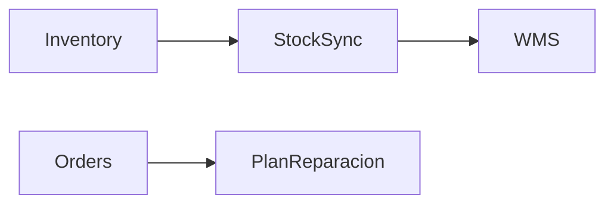
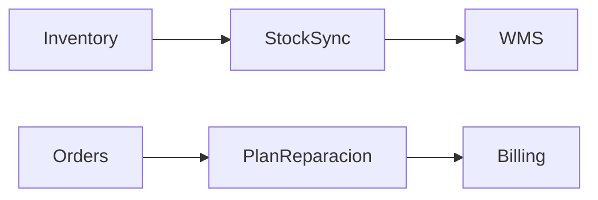

# Business Module Workflow

A repeatable, Claude Code–assisted methodology for building modules, libraries, or inter-module
features in a large-scale business software system.

---

## blueprints/INDEX.md — Global Blueprint Index

Create this file the first time any module, library, or bridge is started. Update it every time a
blueprint is created, changes status, or is deprecated. It is the single source of truth for the
state of the entire system design.

> **Status column is derived from `.blueprint-status` files** — see the section below.
> Never edit the Status column manually; instead update the corresponding `.blueprint-status` file
> and then refresh INDEX.md from it.

### Structure

```markdown
# Blueprints Index
**Updated**: [date]

## Active Modules & Libraries
| Name | Mode | Status | Phase | Owner | Notes |
|------|------|--------|-------|-------|-------|
| [ImportManagement(MODULE)](ImportManagement(MODULE)/BRIEF.md) | MODULE | 🟡 In Progress | Step 4 | @dev | Blocked on API contract review |
| [marketPlazeLib(MODULE)](marketPlazeLib(MODULE)/BRIEF.md) | LIBRARY | ✅ Complete | — | @team | |

## Active Bridges
| Bridge | Connects | Type | Status | Expiry Condition |
|--------|----------|------|--------|-----------------|
| [StockSync(BRIDGE)](StockSync(BRIDGE)/BRIEF.md) | Inventory ↔ WMS | Temporary | 🟡 Active | When WMS v2 ships |
| [PlanReparacion(BRIDGE)](PlanReparacion(BRIDGE)/BRIEF.md) | Orders ↔ Service | Permanent | 🟢 Stable | — |

## Deprecated
| Name | Reason | Deprecated On |
|------|--------|---------------|
| [OldImport(BRIDGE)](OldImport(BRIDGE)/ARCHIVED.md) | Absorbed by ImportManagement | 2024-Q1 |

## Dependency Map (optional)

```

### Status Legend
| Icon | Status | Meaning |
|------|--------|---------|
| 🔵 | `PLANNING` | Blueprint in progress, no code yet |
| 🟡 | `ACTIVE` | Active development |
| 🎯 | `FOCUSED` | Current sprint's primary focus (1–2 max) |
| ⏸️ | `PAUSED` | Halted intentionally; reason in `.blueprint-status` |
| 🔴 | `BLOCKED` | Waiting on external dependency; reason in `.blueprint-status` |
| 🟢 | `STABLE` | In production, blueprint aligned |
| ⚠️ | `DRIFTED` | AUDIT.md flags misalignment |
| 🗄️ | `CLOSED` | Deprecated bridge — ARCHIVED.md exists |

### Claude Code Prompt Pattern
```
Update blueprints/INDEX.md.
New entry: [ModuleName or FeatureName], type: [MODULE/LIBRARY/BRIDGE], status: [STATUS].
[If bridge] Type: [Permanent/Temporary], connects: [ModuleA ↔ ModuleB].
[If deprecated] Reason: [reason], date: [date].
Source status from each blueprint's .blueprint-status file.
Preserve all existing entries.
```

---

## `.blueprint-status` — Per-Blueprint Status File

Every blueprint directory contains a single plain-text file called `.blueprint-status`.
It is the **authoritative source** for that blueprint's current status — INDEX.md reads from it,
never the other way around. Directory names are **never renamed** to encode status.

### Format

One line. Status keyword, optionally followed by `: <reason>`.

```
ACTIVE
```
```
FOCUSED
```
```
PAUSED: waiting for UX sign-off on VIEW_MAP
```
```
BLOCKED: WMS v2 must deploy before this can continue
```
```
CLOSED
```

### Status Values

| Status | Meaning |
|--------|---------|
| `PLANNING` | Blueprint in progress, no code yet |
| `ACTIVE` | Under active development |
| `FOCUSED` | Current sprint's primary development focus (use sparingly — 1–2 at a time) |
| `PAUSED` | Work halted intentionally; will resume. Always add `: <reason>` |
| `BLOCKED` | Waiting on an external dependency before work can continue. Always add `: <dependency>` |
| `STABLE` | In production; blueprint aligned with implementation |
| `DRIFTED` | AUDIT.md flags misalignment between blueprint and implementation |
| `CLOSED` | Temporary bridge that has been deprecated and archived |

> **`FOCUSED` is a sprint-level signal, not a permanent state.** At most 1–2 blueprints should
> carry `FOCUSED` at any time. When a sprint ends, update them back to `ACTIVE`.

### Icon Mapping for INDEX.md

| Status | Icon |
|--------|------|
| `PLANNING` | 🔵 |
| `ACTIVE` | 🟡 |
| `FOCUSED` | 🎯 |
| `PAUSED` | ⏸️ |
| `BLOCKED` | 🔴 |
| `STABLE` | 🟢 |
| `DRIFTED` | ⚠️ |
| `CLOSED` | 🗄️ |

### Claude Code Prompt Pattern

```
Update the .blueprint-status file for blueprints/[Name](MODE)/.
New status: [STATUS]: [optional reason].
Then refresh the Status column for this entry in blueprints/INDEX.md.
```

### Why a file instead of directory prefix?

- **No git rename trauma** — status changes are single-file edits, not directory renames
- **No shell quoting pain** — directory names stay clean
- **Grep-friendly** — `find blueprints -name .blueprint-status | xargs grep BLOCKED` shows all blocked blueprints instantly
- **Richer content** — the reason field (`: <text>`) carries context that a prefix never could
- **Single source of truth** — INDEX.md derives from it; no drift between two places

---

## blueprints/MAP.md — System Roadmap

`MAP.md` answers a different question than `INDEX.md`:

| File | Question |
|------|----------|
| `INDEX.md` | *What exists and what state is it in right now?* |
| `MAP.md` | *Where is the system going? What depends on what? What are we building next?* |

Create `MAP.md` when you have ≥3 blueprints and a multi-sprint horizon. Update it when focus
shifts, blockers change, or the dependency graph evolves.

### Structure

```markdown
# System Roadmap
**Updated**: [date]
**Current Focus**: [1–2 blueprint names that are FOCUSED right now]

## Dependency Graph



> Arrows mean "must complete or be stable before the downstream work begins."

## Sprint / Cycle Focus

| Blueprint | Status | Goal This Sprint |
|-----------|--------|-----------------|
| [OrderManagement(MODULE)](OrderManagement(MODULE)/BRIEF.md) | 🎯 FOCUSED | Complete API contract review |
| [PlanReparacion(BRIDGE)](PlanReparacion(BRIDGE)/BRIEF.md) | 🎯 FOCUSED | Ship to staging |

## Upcoming (Next 2–3 Sprints)

| Blueprint | Mode | Unblocked By | Notes |
|-----------|------|-------------|-------|
| Billing(MODULE) | MODULE | OrderManagement stable | Q3 target |

## Blocked / Waiting

| Blueprint | Blocked On | Owner | Est. Resolution |
|-----------|-----------|-------|----------------|
| WMS(MODULE) | Vendor API contract | @vendor-team | 2024-Q3 |

## North Star

[1–2 sentences: where is the overall system heading in the next 2–4 quarters?]
```

### Relationship to INDEX.md

- `INDEX.md` = **status board** — exhaustive, row-per-blueprint, always current
- `MAP.md` = **roadmap** — curated, forward-looking, focused on sequence and intent
- They reference each other; neither duplicates the other's data

### Claude Code Prompt Pattern

```
Update blueprints/MAP.md.
Current focus: [list FOCUSED blueprints].
New blockers: [list].
Upcoming work: [describe next items].
North star change: [if any].
Keep the dependency graph accurate — add/remove edges as needed.
```

---


Before starting any work, determine which mode applies and tell the user:

### MODULE MODE
Use when:
- Building a new application module from scratch with its own data model, routes, and UI
- The module has no pre-existing architectural patterns to inherit
- Scope spans multiple weeks / multiple developers
- Users interact with the module directly (screens, forms, dashboards)

→ Follow the full workflow below (Steps 0–7). Artifacts go in:
```
blueprints/<ModuleName>(MODULE)/
```

### LIBRARY MODE
Use when:
- Building a reusable SDK, library, or package (KMP, npm, Maven, pip, etc.)
- Primary output is a published artifact (`.jar`, `.tgz`, `.whl`) consumed by other code
- No REST endpoints or application screens — instead: a public API surface (types, interfaces, functions, utilities) that other code imports
- May include optional UI building blocks (React hooks, Angular components, KVision building blocks, etc.) that consumer apps assemble
- Consumers are developers, not end users

→ Follow the **Library Mode workflow** (Section below). Artifacts go in:
```
blueprints/<LibraryName>(MODULE)/
```
> Use the `(MODULE)` suffix — a library is a first-class module, not a bridge.

### BRIDGE MODE
Use when:
- Adding a feature, entity, or workflow that sits *between* two or more existing modules
- The codebase architecture is already established (models, services, views patterns are known)
- Scope is typically 1–2 developers, days to 1–2 weeks
- The task is primarily: new entity + inter-module contracts + a few new/modified views

→ Follow the **Bridge Mode workflow** (Section at bottom of this file). Artifacts go in:
```
blueprints/<FeatureName>(BRIDGE)/
```
The `(BRIDGE)` suffix makes the directory's purpose immediately identifiable when browsing the repo.

### When in doubt, ask:
```
Claude Code prompt:
"I need to implement [description]. Should this be a full module, a library, or a bridge feature?
Summarize: how many new entities, new views/screens, new routes, and which existing modules are touched.
Is the primary output a published artifact consumed by other code, or an application users interact with?"
```
Decision guide — evaluate in this order:

1. **Is the primary output a published artifact consumed by other code** (`.jar`, `.tgz`, `.whl`, npm package)?
   → **LIBRARY MODE** — stop here, regardless of entity count.

2. **Does the scope span ≥3 new entities OR ≥3 new route groups**, with no pre-existing architecture to inherit?
   → **MODULE MODE**

3. **Otherwise** (existing architecture, 1–2 new entities, days-to-weeks scope)
   → **BRIDGE MODE**

---

## Overview of Artifacts

### Root (`blueprints/`)
| File | Purpose |
|------|---------|
| `INDEX.md` | Global status board — all modules, libraries, bridges |
| `MAP.md` | System roadmap — dependency graph, focus, blockers, north star |

### MODULE MODE
| Step | Artifact | Purpose |
|------|----------|---------|
| — | `.blueprint-status` | Single-line status file; source of truth for INDEX.md |
| 0 | `BRIEF.md` | Context, owner, justification |
| 1 | `SPECIFICATION.md` | What the module does |
| 2 | `FLOWCHART.md` | How it flows (Mermaid diagrams) |
| 3 | `API_CONTRACT.md` | How it connects to other modules |
| 4 | `VIEW_MAP.md` | Every screen, view, and UI change |
| 5 | `IMPLEMENTATION_PLAN.md` | How it will be built |
| 6 | `TEST_PLAN.md` | How it will be verified |
| 7 | `TRACEABILITY_MATRIX.md` | Living progress tracker (init after Step 5, update always) |
| — | `AUDIT.md` | Drift detection between blueprint and actual implementation |

### LIBRARY MODE
| Step | Artifact | Purpose |
|------|----------|---------|
| — | `.blueprint-status` | Single-line status file; source of truth for INDEX.md |
| 0 | `BRIEF.md` | Context, owner, library scope, platform/runtime targets, consumer modules |
| 1 | `SPECIFICATION.md` | What the library provides — functional requirements, entities, constraints |
| 2 | `FLOWCHART.md` | Data flows, processing pipelines, async patterns, lifecycle diagrams |
| 3 | `API_SURFACE.md` | Public API: types, interfaces, functions, utilities, published artifact coordinates |
| 4 | `VIEW_MAP.md` | *(Optional)* UI building blocks — only if library provides UI components |
| 5 | `IMPLEMENTATION_PLAN.md` | Build phases — build units, platform/runtime targets, publication steps |
| 6 | `TEST_PLAN.md` | Unit/integration tests per build unit, platform/runtime coverage, serialization |
| 7 | `TRACEABILITY_MATRIX.md` | Living progress tracker |
| — | `AUDIT.md` | Drift detection between API_SURFACE.md and actual implementation |

### BRIDGE MODE
| Step | Artifact | Purpose |
|------|----------|---------|
| — | `.blueprint-status` | Single-line status file; source of truth for INDEX.md |
| B0 | `BRIEF.md` | Scope, actors, affected modules, lifecycle type |
| B1 | `ENTITY_DESCRIPTOR.md` | New entity/entities: states, rules, data model |
| B2 | `SERVICE_CONTRACTS.md` | API / service boundaries between touched modules |
| B3 | `VIEW_MAP.md` | New views + existing views to modify |
| B4 | `IMPLEMENTATION_ORDER.md` | Flat execution order with checkboxes |
| — | `AUDIT.md` | Drift detection between blueprint and actual implementation |
| — | `ARCHIVED.md` | Created on deprecation |

> **TRACEABILITY_MATRIX.md is a living document.** Initialize it after Step 5 and update it
> continuously as work progresses. It is never "done."
>
> **AUDIT.md** is created after initial implementation and revisited at the start of each sprint
> or before onboarding a new developer.
>
> **blueprints/INDEX.md** is updated every time a blueprint is created, deprecated, or its status changes.
> Its status column is sourced from each blueprint's `.blueprint-status` file — never edited manually.
>
> **blueprints/MAP.md** is updated when development focus shifts, blockers change, or the dependency
> graph evolves. It is the roadmap view of the system; INDEX.md is the status board.
>
> **ARCHIVED.md** is created only for Temporary bridges, when their expiry condition is met.

---

## Artifact Navigation

Every `.md` artifact must include a navigation footer so readers can jump between documents without leaving their editor or browser.

### Rules

1. **Always at the bottom** — the nav block is the very last content in the file, after all sections.
2. **Current artifact is bold and not a link** — so the reader knows where they are.
3. **Only link artifacts that already exist** — if an artifact hasn't been generated yet, render it as plain text (no brackets, no link).
4. **Always include the INDEX and MAP links** — even if they are the only links present.
5. **Regenerate when a new artifact is created** — when generating artifact N, update the footer of all previously generated artifacts in the same blueprint directory to add the new link.

### MODULE MODE footer template

```markdown
---
[← Index](../INDEX.md) · [Map](../MAP.md) · **BRIEF** · [SPEC](SPECIFICATION.md) · [FLOWCHART](FLOWCHART.md) · [API](API_CONTRACT.md) · [VIEWS](VIEW_MAP.md) · [PLAN](IMPLEMENTATION_PLAN.md) · [TESTS](TEST_PLAN.md) · [MATRIX](TRACEABILITY_MATRIX.md) · [AUDIT](AUDIT.md)
```

Replace **BRIEF** with the name of the current file in bold. Files not yet created appear as plain text without brackets:

```markdown
---
[← Index](../INDEX.md) · [Map](../MAP.md) · [BRIEF](BRIEF.md) · **SPEC** · FLOWCHART · API · VIEWS · PLAN · TESTS · MATRIX · AUDIT
```

### LIBRARY MODE footer template

```markdown
---
[← Index](../INDEX.md) · [Map](../MAP.md) · **BRIEF** · [SPEC](SPECIFICATION.md) · [FLOWCHART](FLOWCHART.md) · [API SURFACE](API_SURFACE.md) · [VIEWS](VIEW_MAP.md) · [PLAN](IMPLEMENTATION_PLAN.md) · [TESTS](TEST_PLAN.md) · [MATRIX](TRACEABILITY_MATRIX.md) · [AUDIT](AUDIT.md)
```

`VIEW_MAP.md` is optional in LIBRARY MODE. If the library does not provide UI components, omit it from the footer:

```markdown
---
[← Index](../INDEX.md) · [Map](../MAP.md) · [BRIEF](BRIEF.md) · [SPEC](SPECIFICATION.md) · **FLOWCHART** · [API SURFACE](API_SURFACE.md) · [PLAN](IMPLEMENTATION_PLAN.md) · [TESTS](TEST_PLAN.md) · [MATRIX](TRACEABILITY_MATRIX.md) · [AUDIT](AUDIT.md)
```

### BRIDGE MODE footer template

```markdown
---
[← Index](../INDEX.md) · [Map](../MAP.md) · **BRIEF** · [ENTITY](ENTITY_DESCRIPTOR.md) · [CONTRACTS](SERVICE_CONTRACTS.md) · [VIEWS](VIEW_MAP.md) · [ORDER](IMPLEMENTATION_ORDER.md) · [AUDIT](AUDIT.md)
```

### Claude Code Prompt Pattern

When generating any artifact, append this to the generation prompt:

```
After generating the artifact, add the navigation footer at the bottom.
Bold the current file name. Link all artifacts that already exist in this
blueprint directory. Render non-existent artifacts as plain text.
Also update the footer of every previously generated .md artifact in this
directory to add a link to the newly created file.
```

---

## Why This Workflow

### Claude Code Efficiency Gains
Claude Code performs significantly better when given structured context. Without artifacts, it guesses intent, invents data models, and makes integration assumptions that conflict with the rest of your system. With this workflow:
- **SPECIFICATION.md** gives Claude a precise contract to code against — no ambiguity, no hallucinated business rules
- **FLOWCHART.md** lets Claude generate code that handles every branch, not just the happy path
- **API_CONTRACT.md / API_SURFACE.md** means Claude can write integration code that matches what the other module actually emits
- **TEST_PLAN.md** enables Claude to write tests that trace real requirements, not synthetic ones it invented

The result: less back-and-forth correction, fewer "that's not what I meant" moments, and significantly more of Claude's context window spent on building rather than re-clarifying.

### Team Alignment & Onboarding
Every artifact is a communication tool, not just documentation:
- A new developer can read `SPECIFICATION.md` + `FLOWCHART.md` and be productive on day one without needing a senior developer to explain the module
- Disagreements about scope get resolved at Step 1 (cheap) instead of Step 4 (expensive)
- The standard directory structure means any team member can navigate any module instantly — no "where do I find X?" overhead

### Risk Reduction — Catching Errors Early
The artifact chain creates mandatory checkpoints before expensive work begins:

| Where error is caught | Cost |
|-----------------------|------|
| Step 1 — wrong requirement | Near zero — edit a markdown file |
| Step 3 — integration mismatch | Low — update the contract before coding |
| Step 4 — scope too large | Medium — re-plan before building |
| Step 5 — missing test coverage | Medium — add tests before ship |
| After shipping | High — hotfix, rollback, customer impact |

The workflow front-loads discovery. API contract mismatches — the most common large-team failure mode — are caught at Step 3, before a single line of integration code is written.

### Scalability Across Many Modules
In a large system, consistency compounds. When every module follows the same structure:
- Cross-module reviews become fast — reviewers know exactly where to look
- Traceability across the whole system is trivial to aggregate
- Claude can be given artifacts from *multiple* modules and reason about their interactions reliably
- New modules can be bootstrapped by referencing existing ones as patterns

Without a standard, each module becomes a snowflake. The tenth module is as hard to onboard as the first.

### Stakeholder & Management Buy-In
Each artifact maps cleanly to a stakeholder concern:
- **SPECIFICATION.md** → business owner confirms scope before money is spent
- **IMPLEMENTATION_PLAN.md** → management sees phases, timelines, and risks upfront
- **TRACEABILITY_MATRIX.md** → real-time progress visibility without status meetings
- **TEST_PLAN.md** → QA and compliance teams can verify coverage before sign-off

The workflow produces evidence of rigor — useful when justifying timelines, requesting resources, or demonstrating compliance to auditors.

---

# MODULE MODE — Full Application Module Workflow

---

## Step 0: BRIEF.md (Kickoff)

> **Refactoring an existing module?** This workflow applies equally to refactors, but each step
> has important differences. Read `references/refactor-guide.md` before proceeding — it overrides
> and supplements the default behavior of every step below.

### Actions
1. Create the directory:
   ```
   blueprints/
   └── <ModuleName>(MODULE)/
   ```
2. Confirm the following with the team before proceeding:

| Field | Description |
|-------|-------------|
| Module Name | PascalCase identifier, e.g. `ImportManagement` |
| Business Owner | Who is accountable for requirements |
| Business Justification | Why this module is needed now |
| Key Stakeholders | Who reviews and signs off |
| Target Go-Live | Rough date or sprint target |
| Integration Surface | Which other modules it touches |

### Claude Code Prompt Pattern
```
I want to start a new module called [ModuleName] for [system/platform name].
Here's the context: [paste kickoff fields above].
Help me validate this scope is well-defined before we write the specification.
```

### Definition of Done
- [ ] Directory created at `blueprints/<ModuleName>(MODULE)/`
- [ ] `BRIEF.md` created and all kickoff fields populated
- [ ] Business owner has reviewed and signed off on justification and scope
- [ ] Integration surface identified at a high level
- [ ] No unresolved ambiguities before proceeding to Step 1

---

## Step 1: SPECIFICATION.md

### Purpose
Define *what* the module does — its boundaries, rules, data, and actors.

### Required Sections
1. **Module Objective & Scope** — one paragraph, no ambiguity
2. **Functional Requirements** — numbered list, testable statements ("The system SHALL…")
3. **Business Rules & Constraints** — edge cases, limits, legal/regulatory rules
4. **User Roles & Permissions** — who can read, write, approve, admin
5. **Data Models & Relationships** — key entities, fields, foreign keys, cardinality
6. **Integration Points** — named modules and the data exchanged
7. **Performance Requirements** — response times, batch sizes, concurrency
8. **Security Considerations** — data sensitivity, audit logging, access control

### Claude Code Prompt Pattern
```
Using the kickoff brief for [ModuleName], generate a full SPECIFICATION.md.
The module touches [list integration points].
Key business rules include: [paste any known constraints].
Flag any ambiguities you find and ask me to resolve them before finalizing.
```

### Definition of Done
- [ ] All 8 sections present and non-empty
- [ ] No unresolved ambiguities (Claude flags, human resolves)
- [ ] Business owner has reviewed and signed off

---

## Step 2: FLOWCHART.md

### Purpose
Visually map every path through the module using **Mermaid diagrams**.

### Required Diagrams
1. **Happy Path Flow** — the standard, no-errors journey end-to-end
2. **Decision Tree** — every branch point with conditions labeled
3. **Exception Handling Paths** — what happens on errors, rejections, timeouts
4. **Integration Event Flow** — when/what this module sends to or receives from others
5. **Role-Based View** — what each user role sees and can trigger

### Mermaid Conventions
- Use `flowchart TD` for process flows
- Use `sequenceDiagram` for integration event flows
- Label every arrow with the triggering condition
- Use subgraphs to group related steps

### Claude Code Prompt Pattern — Generate
```
Based on SPECIFICATION.md for [ModuleName], generate FLOWCHART.md.
Use Mermaid diagrams. I need:
1. Happy path flowchart
2. Decision tree with all branch conditions
3. Exception handling paths
4. Integration sequence diagram with [list connected modules]
5. Role-based view for: [list roles]
Be exhaustive — more detail is better here.
```

### Definition of Done
- [ ] All 5 diagram types present
- [ ] Every requirement from SPECIFICATION.md traceable to at least one flow step
- [ ] Exception paths exist for every decision node
- [ ] Diagrams render without errors in a Mermaid previewer

---

## Step 3: API_CONTRACT.md

### Purpose
Define the integration boundaries precisely so other modules can build against this one
independently. This is the **contract** — changes here require cross-team sign-off.

### Required Sections
1. **Inbound Events / APIs** — what this module accepts (endpoint, payload, auth)
2. **Outbound Events / APIs** — what this module emits (event name, payload, trigger condition)
3. **Shared Data Entities** — any DB tables or DTOs shared across module boundaries
4. **Error Codes & Responses** — standard error envelope, module-specific codes
5. **Versioning Policy** — how breaking changes will be communicated
6. **Consumer Modules** — which modules depend on this contract

### Format for Each API Entry
```markdown
### POST /api/[module]/[resource]
- **Purpose**: ...
- **Auth**: Bearer token, role: [role]
- **Request Body**: (JSON schema or typed fields)
- **Response**: (success + error shapes)
- **Side Effects**: (events emitted, state changes)
- **SLA**: max response time
```

### Claude Code Prompt Pattern
```
Based on SPECIFICATION.md and FLOWCHART.md for [ModuleName],
generate API_CONTRACT.md. This module integrates with: [list modules].
Define all inbound and outbound interfaces. Flag any integration points
that are underspecified and need cross-team clarification.
```

### Definition of Done
- [ ] Every integration point from SPECIFICATION.md has a contract entry
- [ ] All consumer modules listed and notified
- [ ] Error codes defined
- [ ] Reviewed by the tech lead of each consumer module

---

## Step 4: VIEW_MAP.md

### Purpose
Enumerate every UI surface the module introduces or modifies — before implementation planning,
so the frontend scope is explicit and nothing gets missed or over-built.

### Required Sections
1. **View Inventory by Domain Area** — group views into logical sections
2. **New Views** — each new page/screen/modal/component with purpose and actor
3. **Modified Views** — each existing view that changes, with an explicit diff description
4. **Role-Based Access Matrix** — rows = views, columns = roles, cells = read / write / hidden
5. **State-to-View Traceability** — every state from the FLOWCHART.md state machine must map to ≥1 view
6. **Navigation Changes** — new routes, menu entries, permission guards
7. **Shared Components** — new reusable components introduced by this module
8. **Empty / Error / Loading States** — explicit design decisions for each view

### Format for Each View Entry
```markdown
### [ViewName] — NEW | MODIFIED
- **Group**: (domain area this view belongs to)
- **Type**: Page / Modal / Component / Section
- **Route**: /path/to/view (if applicable)
- **Actors**: which roles access this (read / write)
- **Purpose**: one sentence
- **Key Elements**: table, form, status badge, action buttons…
- **Data Sources**: which API endpoints / services feed this view
- **States Displayed**: which entity states from the state machine appear here
- **Empty State**: what the user sees when there is no data
- **Error State**: what the user sees on load failure or validation error
- **Loading State**: skeleton, spinner, or other pattern
- **Modifications** (if MODIFIED): describe the delta only — not a full rewrite
```

### Definition of Done
- [ ] All views grouped by domain area
- [ ] Every state from FLOWCHART.md state machine has ≥1 view
- [ ] Every actor from SPECIFICATION.md has ≥1 entry point
- [ ] Role-based access matrix complete for all roles × all views
- [ ] Empty, error, and loading states defined for every view
- [ ] All modified views have explicit diff descriptions

---

## Step 5: IMPLEMENTATION_PLAN.md

### Purpose
Break the specification into buildable phases with clear milestones, dependencies, and estimates.

### Required Sections
1. **Phase Breakdown** — 3–5 phases, each with a clear deliverable
2. **Milestones Table** — phase, deliverable, owner, estimated effort, dependency
3. **Technical Objectives per Phase** — what gets built, what decisions get made
4. **Component Dependency Graph** — what must be done before what
5. **Resource Allocation** — who works on what
6. **Risk Register** — top 5 risks with mitigation

### Phase Structure Template
```markdown
## Phase N: [Name]
- **Deliverable**: ...
- **Technical Objectives**: ...
- **Dependencies**: (phases or external items that must complete first)
- **Estimated Effort**: X dev-days
- **Owner**: ...
- **Risks**: ...
```

### Definition of Done
- [ ] 3–5 phases defined, each with a shippable deliverable
- [ ] All spec requirements mapped to a phase
- [ ] All views from VIEW_MAP.md assigned to a phase
- [ ] Risk register has at least 3 entries
- [ ] Tech lead and project owner have approved

---

## Step 6: TEST_PLAN.md

### Purpose
Document complete user journeys that validate the module end-to-end, tracing every path
in the flow chart against every requirement in the spec.

### Required Sections
1. **Test Coverage Matrix** — requirement ID → test ID mapping
2. **Happy Path Scenarios** — step-by-step, role-by-role
3. **Edge Case Scenarios** — boundary values, empty states, max load
4. **Error & Exception Scenarios** — every exception path from the flow chart
5. **Integration Scenarios** — cross-module flows
6. **Success Criteria** — explicit pass/fail definition per test

### Test Entry Format
```markdown
### TEST-[NNN]: [Scenario Name]
- **Covers**: REQ-[N], REQ-[N]
- **Role**: [user role performing this test]
- **Preconditions**: ...
- **Steps**: numbered list
- **Expected Result**: ...
- **Pass Criteria**: ...
```

### Definition of Done
- [ ] Every requirement has ≥1 test
- [ ] Every flow chart path has ≥1 test
- [ ] Every view in VIEW_MAP.md has ≥1 UI test
- [ ] All exception paths covered
- [ ] QA lead has reviewed

---

## Step 7: TRACEABILITY_MATRIX.md (Living Document)

### Purpose
Track progress across phases and link completed work to requirements.
**Initialize after Step 5. Update after every PR merge, milestone, or sprint.**

### Structure
```markdown
## Module: [ModuleName]
**Last Updated**: [date]
**Overall Status**: [% complete]

## Timeline (Gantt)

```mermaid
gantt
  title [ModuleName] — Phase Progress
  dateFormat YYYY-MM-DD
  section Phase 1
    [Task name]  :done,    p1a, YYYY-MM-DD, YYYY-MM-DD
    [Task name]  :active,  p1b, YYYY-MM-DD, YYYY-MM-DD
  section Phase 2
    [Task name]  :         p2a, YYYY-MM-DD, YYYY-MM-DD
```

> Task states: `done` = completed, `active` = in progress, `crit` = blocked/at risk, *(none)* = not started.

## Requirement Traceability
| REQ-ID | Description | Phase | Status | Test ID | Notes |
|--------|-------------|-------|--------|---------|-------|

## Milestone Tracker
| Milestone | Planned | Actual | Delta | Owner | Blockers |
|-----------|---------|--------|-------|-------|----------|

## Open Issues
| Issue | Impact | Owner | Target Resolution |
|-------|--------|-------|-------------------|
```

### Definition of Done
*This document is never "done" — it is complete when the module ships and all requirements show "Verified" and all Gantt tasks show "done".*

---

## AUDIT.md — Blueprint vs. Implementation Drift Detection

Create `AUDIT.md` after initial implementation is underway. Revisit at the start of each sprint
or before onboarding a new developer.

### Structure

```markdown
# Audit — [ModuleName]
**Last Audit**: [date]
**Audited By**: [person or "Claude Code assisted"]
**Overall Status**: ✅ Aligned | ⚠️ Partial Drift | 🔴 Stale

## Drift Log
| Artifact | Section | Blueprint Says | Reality | Severity | Action |
|----------|---------|---------------|---------|----------|--------|

## Audit Checklist
- [ ] Every FR in SPECIFICATION.md has a corresponding implementation or explicit deferral
- [ ] API_CONTRACT.md (MODULE) or API_SURFACE.md (LIBRARY) matches current signatures
- [ ] VIEW_MAP.md matches current views in codebase (if applicable)
- [ ] TRACEABILITY_MATRIX.md status reflects actual completion
- [ ] BRIEF.md scope still matches what was built

## Notes
[Free-form observations — decisions made during implementation that diverge from the blueprint]
```

### Claude Code Prompt Pattern
```
Perform a blueprint audit for [ModuleName].
Read all artifacts in blueprints/[ModuleName](MODULE)/.
Then inspect the actual codebase: [describe where to look, e.g. "src/modules/[ModuleName]/"].
For each artifact, compare blueprint claims against reality and populate the Drift Log.
Flag every discrepancy with a severity (Low / Medium / High / Critical).
At the end, set the Overall Status and list recommended actions.
```

### Severity Guide
| Level | Meaning |
|-------|---------|
| Low | Minor wording or format difference, no functional impact |
| Medium | Missing feature or changed behavior, no blocker |
| High | Contract mismatch or missing requirement that affects other modules |
| Critical | Blueprint actively misleads — must update before next onboarding |

---

## MODULE MODE — Full Workflow Summary

```
blueprints/INDEX.md        → create on first module/bridge; refresh status from .blueprint-status files
blueprints/MAP.md          → create when ≥3 blueprints exist; update when focus or blockers change

Step 0: Kickoff → confirm scope, create directory, create .blueprint-status (initial: PLANNING)
Step 1: SPECIFICATION.md → what the module does
Step 2: FLOWCHART.md → how it flows
Step 3: API_CONTRACT.md → how it connects (share with other teams)
Step 4: VIEW_MAP.md → every screen and UI change
Step 5: IMPLEMENTATION_PLAN.md → how it will be built
         └─ Initialize TRACEABILITY_MATRIX.md here; update .blueprint-status → ACTIVE
Step 6: TEST_PLAN.md → how it will be verified
Step 7: TRACEABILITY_MATRIX.md → update continuously through development
AUDIT.md → create after initial implementation; revisit each sprint
.blueprint-status → update on every status change (PLANNING → ACTIVE → FOCUSED / PAUSED / BLOCKED → STABLE)
```

> See `references/example-prompts.md` for a full set of Claude Code prompts per module type.
> See `references/business-module-checklist.md` for a printable per-module checklist.
> See `references/refactor-guide.md` for step-by-step guidance when refactoring an existing module.

---

# LIBRARY MODE — SDK / Package / Reusable Library Workflow

Use this section when Mode Selection determined **LIBRARY MODE**. This mode is optimized for
libraries, SDKs, and packages where the primary output is a published artifact consumed by other
code — not a user-facing application.

Key differences from MODULE MODE:
- **Step 3 uses `API_SURFACE.md`** instead of `API_CONTRACT.md` — documents the public API surface
  (types, interfaces, functions, utilities) that consumers import, rather than REST endpoints.
- **Step 4 (`VIEW_MAP.md`) is optional** — only include if the library provides UI building blocks
  that consumer apps assemble (e.g. React hooks, Angular directives, KVision components).
- **TEST_PLAN.md** includes required sections for per-target coverage and serialization tests.
  *(If using KMP: JVM/JS/Native target matrix and JSON round-trip tests.)*

---

## Library Step 0: BRIEF.md (Kickoff)

### Purpose
Establish the library's identity, scope, consumer dependencies, and target platforms before any design work begins. This is the contract between the library author and the teams that will depend on it.

### Actions
1. Create the directory:
   ```
   blueprints/
   └── <LibraryName>(MODULE)/
   ```
2. Confirm the following fields:

| Field | Description |
|-------|-------------|
| Library Name | PascalCase identifier, e.g. `MarketPlazeLib` |
| Business Owner | Who is accountable |
| Business Justification | Why this library is needed now |
| Platform/Runtime Targets | Which runtimes/targets this library supports. e.g. KMP: JVM/JS/Native · npm: Node 18+ · pip: Python 3.10+ |
| Published Artifacts | Package coordinates (e.g. Maven `com.example:myLib`, npm `@scope/lib`, PyPI `mylib`) |
| Consumer Modules | Apps / modules that will depend on this library |
| Integration Surface | Libraries this library depends on |

### Claude Code Prompt Pattern
```
I want to start a new library called [LibraryName] for [system/platform name].
Here's the context: [paste kickoff fields above].
Help me validate the scope: confirm what is and isn't part of the public API,
and list which consumer modules will depend on this library.
```

### Definition of Done
- [ ] Directory created at `blueprints/<LibraryName>(MODULE)/`
- [ ] `BRIEF.md` created and all fields populated
- [ ] Consumer modules identified and notified
- [ ] Published artifact coordinates defined (group:artifact)
- [ ] Platform/runtime targets agreed upon (e.g. KMP targets, Node version, Python version)
- [ ] No unresolved ambiguities before proceeding to Step 1

---

## Library Step 1: SPECIFICATION.md

### Purpose
Define *what* the library does — its functional requirements, data contracts, consumer roles, and platform constraints. This is the foundation all subsequent artifacts build on.

### Required Sections
1. **Library Objective & Scope** — one paragraph
2. **Functional Requirements** — numbered list, testable ("The library SHALL…")
3. **Business Rules & Constraints** — calculation rules, precision constraints, edge cases
4. **Consumer Roles** — which consumer types use which parts of the library
5. **Data Models & Relationships** — entities, value types, enums, and language-specific sum types *(e.g. Kotlin sealed classes, TypeScript discriminated unions, Python enums)*
6. **Integration Points** — dependencies (other libraries) and data exchanged
7. **Performance Requirements** — latency constraints, memory footprint
8. **Platform/Target Constraints** — which APIs are available on which targets/runtimes
   *(If KMP: commonMain vs jvmMain vs jsMain availability)*

### Claude Code Prompt Pattern
```
Using the kickoff brief for [LibraryName], generate a full SPECIFICATION.md.
Consumer modules are: [list].
Known business rules or constraints: [paste any].
Flag any requirement that would need to be target-specific (e.g. JVM-only, browser-only).
Flag any ambiguities before finalizing.
```

### Definition of Done
- [ ] All 8 sections present and non-empty
- [ ] Every requirement is testable — no vague language
- [ ] Platform/target constraints noted per API area
- [ ] No unresolved ambiguities (Claude flags, human resolves)
- [ ] Business owner has reviewed and signed off

---

## Library Step 2: FLOWCHART.md

### Purpose
Visually map how data flows through the library, how stateful components behave over time, and how consumer apps interact with the public API. Diagrams surface ambiguities in the spec before any code is written.

### Required Diagrams
1. **Core Processing Flow** — how the library's main algorithm or pipeline works
2. **Lifecycle Diagrams** — for any stateful components (schedulers, sync engines, etc.)
3. **Data Transformation Flow** — how input data flows through the library's functions
4. **Integration Flow** — how consuming apps call the library and what happens
5. **Exception / Error Handling Paths** — what the library returns on failure

### Claude Code Prompt Pattern
```
Based on SPECIFICATION.md for [LibraryName], generate FLOWCHART.md.
Use Mermaid diagrams. I need:
1. Core processing flow (main algorithm or pipeline)
2. Lifecycle diagram for any stateful components
3. Data transformation flow (input → library → output)
4. Integration flow showing how consumer apps call the library
5. Exception / error handling paths
Be exhaustive on the error paths — a library must never silently swallow errors.
```

### Definition of Done
- [ ] All 5 diagram types present
- [ ] Every requirement from SPECIFICATION.md traceable to at least one flow step
- [ ] Error / Result paths explicit for every operation that can fail
- [ ] Diagrams render without errors in a Mermaid previewer

---

## Library Step 3: API_SURFACE.md

### Purpose
Document the complete public API surface of the library — what consumers import and depend on.
This is the **published contract** — breaking changes require a major version bump.

### Required Sections
1. **Published Artifacts** — package coordinates and version *(e.g. Maven `group:artifact`, npm `@scope/lib`, PyPI `mylib`)*, plus platform/runtime targets
2. **Core Entities & Models** — data classes, entities, their fields and constraints
3. **Service & Algorithm Interfaces** — public interfaces, base classes, top-level functions, and other callable API *(e.g. abstract classes in OOP, protocols in Swift/Python, type classes in Haskell)*
4. **Value Types** — enums, discriminated unions, sealed types, and other value-only types *(e.g. Kotlin inline/sealed classes, TypeScript union types, Python enums)*
5. **Utility / Extension API** — utility functions, extension functions, or mixins provided to consumers *(e.g. Kotlin extension functions, JS prototype extensions, Python helper modules)*
6. **UI Building Blocks** *(optional)* — column definitions, filter views, form builders (if applicable)
7. **Error / Result Types** — how the library communicates failure
8. **Versioning Policy** — semantic versioning rules for this library

### Format for Each API Entry

> **Adapt to your language/platform.** The template shows one possible structure; adapt field names and the Signature block to your language.
> For TypeScript: use `package` for `Module/Package`, omit `Platform/Targets`, use TS signatures.
> For Python: use `module path` for `Module/Package`, omit `Platform/Targets`, use Python type hints.

```markdown
### [ClassName] / [FunctionName]
- **Kind**: Entity | Interface | Base Type | Object | Function | Value Type | UI Component
- **Module/Package**: [build unit path, e.g. commonLib/commonMain | @scope/core | mylib.core]
- **Platform/Targets**: [runtimes this symbol is available on, e.g. JVM · JS · Node · Python 3.10+]
- **Purpose**: one sentence
- **Signature**:
  ```
  // language-appropriate signature, type definition, or data class fields
  ```
- **Constraints**: (nullability, ranges, validation rules)
- **Side Effects**: (events, state changes, if any)
- **Consumers**: (which apps/modules use this)
```

### Claude Code Prompt Pattern
```
Based on SPECIFICATION.md and FLOWCHART.md for [LibraryName],
generate API_SURFACE.md.
Consumer modules: [list].
Platform/runtime targets: [list, e.g. JVM+JS, Node 18, Python 3.10+].
Document all: entities, interfaces, base types, top-level functions,
value/utility types, utility/extension API, [and UI building blocks if applicable].
Flag any API that is target-specific (e.g. JVM-only, browser-only, Node-only).
Flag any breaking change vs. the previous version.
```

### Definition of Done
- [ ] All public types documented (no undocumented public symbols)
- [ ] Platform/runtime target availability noted for each entry
- [ ] Consumer modules listed
- [ ] Breaking changes from previous version flagged
- [ ] Reviewed by consumer module leads

---

## Library Step 4: VIEW_MAP.md *(Optional)*

### Purpose
Enumerate every UI building block the library exports so consumer teams know exactly what they can assemble without reading source code. Only needed if the library provides UI components.

Only include this artifact if the library provides **UI building blocks** that consumer apps assemble
(e.g., React hooks, Angular directives, KVision column definitions).

If the library has no UI components, skip this step and omit `VIEW_MAP.md` from the navigation footer.

### When included, required sections:
> **Adapt section names to your UI framework.** The examples below use KVision patterns.
> For React: replace "Column Definitions" with "Component Inventory", "Filter View Builders" with "Hook Catalog", etc.

1. **Building Block Inventory** — grouped by domain area (e.g., "Marketplace columns", "Product forms")
2. **UI Component / Column Definitions** — each exported component or `colDef*()` function: purpose, props/params, display type
3. **Filter / Query Builders** — each filter or query builder: entities filtered, input types
4. **Form Field Builders** — each form builder: fields included, layout
5. **Consumer Assembly Pattern** — how consuming apps use these building blocks (code example)
6. **Samples Module** — reference implementations provided (if applicable)

---

## Library Step 5: IMPLEMENTATION_PLAN.md

### Purpose
Break the library build into phases ordered by dependency — shared/common code first, then platform-specific targets, then publication. Makes the build sequence explicit and assignable.

### Required Sections
Same as MODULE MODE, with these library-specific additions:
- **Build Unit Breakdown** — which build units (packages/modules) get built in which phase *(e.g. Gradle modules, npm workspaces, Python packages)*
- **Target/Runtime Build Order** — the order in which platform targets or runtimes are built *(e.g. KMP: commonMain first, then jvmMain, then jsMain; npm: CJS then ESM; pip: sdist then wheel)*
- **Publication Steps** — when and how to publish to the relevant registry *(Maven Local/Central, npm registry, PyPI, etc.)*

### Phase Structure Template
```markdown
## Phase N: [Name]
- **Deliverable**: [publishable artifact or milestone]
- **Build Units Affected**: [e.g. commonLib + shopifyLib | @scope/core | mylib.core]
- **Target/Runtimes**: [e.g. commonMain/jvmMain | Node 18 CJS+ESM | Python 3.10+]
- **Technical Objectives**: ...
- **Dependencies**: (phases or external libraries)
- **Estimated Effort**: X dev-days
```

### Claude Code Prompt Pattern
```
Based on SPECIFICATION.md and FLOWCHART.md for [LibraryName],
generate IMPLEMENTATION_PLAN.md.
Build units: [list, e.g. Gradle modules / npm workspaces / Python packages].
Platform/runtime targets: [list].
Publication registry: [e.g. Maven Central / npm / PyPI].
Use 3–5 phases, each with a publishable milestone.
Order: shared/common code first, then platform-specific targets, then publication.
Flag any phase that requires coordination with consumer module teams.
```

---

## Library Step 6: TEST_PLAN.md

### Purpose
Document the test strategy that validates every public symbol across every supported platform/runtime. A library ships to many consumers — gaps in test coverage become their production bugs.

### Required Sections
1. **Test Coverage Matrix** — FR-ID → Test ID mapping
2. **Unit Tests by Build Unit** — per package/module, grouped by tested class/function *(e.g. per Gradle module, per npm workspace, per Python package)*
3. **Platform/Runtime Coverage** — which tests run on which targets/runtimes

```markdown
### Platform/Runtime Coverage
| Test Class | [Target A] | [Target B] | [Target C] |
|-----------|------------|------------|------------|
| ExampleTest | ✅ | ⬜ | ⬜ |
```
*(e.g. KMP: JVM / JS / Native · npm: Node / Browser · pip: Python 3.10 / 3.11)*

4. **Serialization / Schema Tests** — round-trip tests for all serializable entities or data contracts
5. **Integration Tests** — end-to-end scenarios using test doubles or in-memory implementations
6. **Known Gaps** — untested areas and justification (e.g., visual components, live API calls)

### Claude Code Prompt Pattern
```
Based on SPECIFICATION.md, FLOWCHART.md, and API_SURFACE.md for [LibraryName],
generate TEST_PLAN.md.
Build units: [list].
Platform/runtime targets: [list — each target needs its own coverage column].
For each public symbol in API_SURFACE.md, include at least one unit test.
Include serialization/schema round-trip tests for all data types.
Use InMemoryRepository or test doubles for integration tests — no live dependencies.
```

### Test Entry Format
Same as MODULE MODE (`TEST-[NNN]` format).

---

## Library TRACEABILITY_MATRIX.md and AUDIT.md

Same structure as MODULE MODE.

### Claude Code Prompt Pattern (initialize TRACEABILITY_MATRIX.md)
```
Based on IMPLEMENTATION_PLAN.md for [LibraryName], generate TRACEABILITY_MATRIX.md.
Initialize the Gantt with all phases and tasks from the plan.
Initialize the Requirement Traceability table with all FR-IDs from SPECIFICATION.md.
Set all statuses to "Not Started". Leave Test ID column blank — fill as tests are written.
```

For `AUDIT.md`, the checklist adapts:

```markdown
## Audit Checklist
- [ ] Every FR in SPECIFICATION.md has a corresponding implementation or explicit deferral
- [ ] API_SURFACE.md matches current public API signatures
- [ ] VIEW_MAP.md (if present) matches current UI building blocks
- [ ] TRACEABILITY_MATRIX.md status reflects actual completion
- [ ] BRIEF.md scope still matches what was built
```

---

## LIBRARY MODE — Full Workflow Summary

```
blueprints/INDEX.md        → create on first use; refresh status from .blueprint-status files
blueprints/MAP.md          → create when ≥3 blueprints exist; update when focus or blockers change

Step 0: BRIEF.md → library name, platform/runtime targets, consumer modules
         └─ Create .blueprint-status (initial: PLANNING)
Step 1: SPECIFICATION.md → functional requirements, entities, business rules
Step 2: FLOWCHART.md → data flows, lifecycle diagrams, processing pipelines
Step 3: API_SURFACE.md → public interfaces, types, functions, published artifact coordinates
Step 4: VIEW_MAP.md → [OPTIONAL] UI building blocks (components, hooks, form builders)
Step 5: IMPLEMENTATION_PLAN.md → build unit phases, target/runtime order, publication steps
         └─ Initialize TRACEABILITY_MATRIX.md here; update .blueprint-status → ACTIVE
Step 6: TEST_PLAN.md → unit tests per build unit, platform/runtime coverage, serialization
Step 7: TRACEABILITY_MATRIX.md → update continuously through development
AUDIT.md → create after initial implementation; revisit each sprint
.blueprint-status → update on every status change

Directory: blueprints/<LibraryName>(MODULE)/
Footer: [← Index] · [Map] · BRIEF · SPEC · FLOWCHART · API SURFACE · [VIEWS] · PLAN · TESTS · MATRIX · AUDIT
```

---

# BRIDGE MODE — Scoped Feature Workflow

Use this section when Mode Selection determined **BRIDGE MODE**. Do not run the full MODULE MODE workflow (Steps 0–7).

Bridge Mode produces 5 core artifacts (B0–B4), plus AUDIT.md and optionally ARCHIVED.md. All live in:
```
blueprints/<FeatureName>(BRIDGE)/
```

## Bridge Artifacts Overview

| Step | Artifact | Purpose |
|------|----------|---------|
| B0 | `BRIEF.md` | Scope, actors, affected modules, justification, lifecycle type |
| B1 | `ENTITY_DESCRIPTOR.md` | New entity/entities: states, rules, data model |
| B2 | `SERVICE_CONTRACTS.md` | API / service boundaries between touched modules |
| B3 | `VIEW_MAP.md` | New views + existing views to modify |
| B4 | `IMPLEMENTATION_ORDER.md` | Flat execution order with checkboxes |
| — | `AUDIT.md` | Drift detection between blueprint and actual implementation |
| — | `ARCHIVED.md` | Created on deprecation — explains what happened and why |

> No FLOWCHART.md (use a single integration diagram inside ENTITY_DESCRIPTOR.md instead).
> No TRACEABILITY_MATRIX.md — use IMPLEMENTATION_ORDER.md checkboxes for progress tracking.

---

## B0: BRIEF.md

### Purpose
Confirm scope and boundaries before any design work. Keep it short — this is a bridge, not a module.

### Required Fields

| Field | Description |
|-------|-------------|
| Feature Name | PascalCase, e.g. `PlanReparacion` |
| Business Problem | One sentence: why this feature exists |
| Affected Modules | List every existing module touched (read or write) |
| New Entities | List new DB entities / models |
| Out of Scope | Explicit list of what this feature does NOT do |
| Owner | Who is accountable |
| Target | Rough date or sprint |
| **Lifecycle Type** | **Permanent** or **Temporary** |
| **Expiry Condition** | *(Temporary only)* The condition that makes this bridge obsolete |
| **Absorption Target** | *(Temporary only)* Which module will eventually own this functionality |
| **Planned Deprecation** | *(Temporary only)* Estimated sprint or date for deprecation |

### Claude Code Prompt Pattern
```
I need to implement [FeatureName] — a bridge feature between [ModuleA] and [ModuleB].
Context: [describe the business need in 2-3 sentences].
Existing entities involved: [list].
Architecture pattern: [describe your stack/patterns briefly].

Help me write BRIEF.md. Confirm the scope is tight and explicitly list what is out of scope.
Declare the lifecycle type (Permanent or Temporary) and, if Temporary, define the expiry condition.
```

### Definition of Done
- [ ] All fields filled
- [ ] Lifecycle type declared (Permanent or Temporary)
- [ ] If Temporary: expiry condition is specific and measurable, not vague
- [ ] Out of Scope section has ≥3 explicit exclusions
- [ ] Affected modules confirmed with their tech leads
- [ ] No ambiguities before proceeding to B1

---

## B1: ENTITY_DESCRIPTOR.md

### Purpose
Define the new entity (or entities) precisely: its states, transitions, business rules, and data model.
Also includes a single integration flow diagram showing how data moves between affected modules.

### Required Sections
1. **Entity Overview** — one paragraph, what it represents in the domain
2. **State Machine** — all states, transitions, and trigger conditions (Mermaid `stateDiagram-v2`)
3. **Business Rules** — numbered, testable statements ("The system SHALL…")
4. **Data Model** — fields, types, constraints, foreign keys to existing entities
5. **Integration Flow** — sequence diagram showing data flow across affected modules (Mermaid `sequenceDiagram`)
6. **Actor Matrix** — who can create / read / update / transition this entity

### Claude Code Prompt Pattern
```
Based on BRIEF.md for [FeatureName], generate ENTITY_DESCRIPTOR.md.
Existing modules involved: [list with their key entities/models].
Known business rules: [paste any].
I need:
- A state machine diagram for [EntityName]
- A sequence diagram showing the flow between [ModuleA] → [FeatureName] → [ModuleB]
- A data model that fits our existing [ORM/schema pattern]
Flag any rules that are ambiguous or conflict with existing module behavior.
```

### Definition of Done
- [ ] State machine covers all states — including error/rejection states
- [ ] Every transition has a named trigger condition
- [ ] Data model lists FK relationships to existing tables
- [ ] Integration sequence diagram includes all affected modules
- [ ] Business rules are numbered and testable

---

## B2: SERVICE_CONTRACTS.md

### Purpose
Define the exact API / service boundaries between this feature and every module it touches.
This is the document you share with other teams before writing a single line of integration code.

### Required Sections
1. **Contract Summary Table** — one row per integration point: direction, caller, method, purpose
2. **Service / API Entries** — one entry per endpoint or service method
3. **Events Emitted** — any domain events this feature publishes
4. **Events Consumed** — any domain events this feature listens to
5. **Shared Entities / DTOs** — any data structures crossing module boundaries

### Format for Each Contract Entry
```markdown
### [METHOD] [ServiceName].[methodName] / POST /api/[resource]
- **Direction**: [FeatureName] → [ModuleName] | [ModuleName] → [FeatureName]
- **Trigger**: when does this get called?
- **Input**: (typed fields or JSON schema)
- **Output**: (success shape + error shape)
- **Side Effects**: state changes, events emitted
- **Owner**: which team owns this contract
```

### Claude Code Prompt Pattern
```
Based on BRIEF.md and ENTITY_DESCRIPTOR.md for [FeatureName],
generate SERVICE_CONTRACTS.md.
Integration points are:
- [FeatureName] reads from [ModuleA]: [what data]
- [FeatureName] writes to [ModuleB]: [what data]
- [FeatureName] triggers [action] in [ModuleC]
Use our existing service pattern: [describe pattern, e.g. "repository + service layer, REST endpoints"].
Flag any integration point that requires a breaking change to an existing module.
```

### Definition of Done
- [ ] Every integration point from BRIEF.md has a contract entry
- [ ] All affected module tech leads have reviewed
- [ ] No breaking changes undocumented
- [ ] Events section complete (even if empty — explicitly state "no events")

---

## B3: VIEW_MAP.md

### Purpose
Enumerate every UI change required: new views to create and existing views to modify.

> **Intentionally simplified** vs MODULE MODE VIEW_MAP. Bridge scope is narrow — no role-based
> access matrix, no empty/error/loading states required. If the feature grows beyond 4–5 views,
> reconsider whether MODULE MODE is the right fit.

### Required Sections
1. **New Views** — each new view/screen/component with its purpose and actor
2. **Modified Views** — each existing view that changes, with a diff description
3. **Navigation Changes** — new routes, menu entries, or permission guards
4. **Shared Components** — any new reusable components introduced

### Format for Each View Entry
```markdown
### [ViewName] — NEW | MODIFIED
- **Type**: Page / Modal / Component / Section
- **Route**: /path/to/view (if applicable)
- **Actor**: which roles access this
- **Purpose**: one sentence
- **Key Elements**: list of main UI elements
- **Data Sources**: which service/API feeds this view
- **Modifications** (if MODIFIED): describe what changes vs. current behavior
```

### Claude Code Prompt Pattern
```
Based on ENTITY_DESCRIPTOR.md and SERVICE_CONTRACTS.md for [FeatureName],
generate VIEW_MAP.md.
Existing views in affected modules: [list them or say "none"].
Our frontend pattern: [e.g. "Vue 3 + Quasar, one .vue file per view"].
For modified views, describe only the delta — not a full rewrite.
Flag any view change that could break existing functionality for other user roles.
```

### Definition of Done
- [ ] Every state from the state machine has at least one view that displays it
- [ ] Every actor from the actor matrix has at least one entry point
- [ ] All modified views have explicit diff descriptions
- [ ] Frontend lead has reviewed

---

## B4: IMPLEMENTATION_ORDER.md

### Purpose
Define the exact execution sequence for building the feature — a flat, ordered checklist.
Not phases, not sprints — just the order that respects dependencies so nothing blocks.

### Structure
```markdown
# Implementation Order — [FeatureName](BRIDGE)
**Updated**: [date]
**Status**: [X/N tasks complete]

## Checklist

### Layer 1 — Data
- [ ] B4-01 · Create migration for [EntityName] table
- [ ] B4-02 · Add FK [field] to [ExistingTable]

### Layer 2 — Business Logic
- [ ] B4-03 · Implement [EntityName] service
- [ ] B4-04 · Unit tests for state machine transitions

### Layer 3 — Integration
- [ ] B4-05 · Implement contract: [FeatureName] → [ModuleA].[method]
- [ ] B4-06 · Integration tests for contracts

### Layer 4 — UI
- [ ] B4-07 · Create view: [NewViewName]
- [ ] B4-08 · Modify view: [ExistingViewName] (delta: [description])

### Layer 5 — Validation
- [ ] B4-09 · End-to-end test: [happy path]
- [ ] B4-10 · Smoke test in staging
```

### Claude Code Prompt Pattern (generate)
```
Based on all artifacts for [FeatureName](BRIDGE), generate IMPLEMENTATION_ORDER.md.
Our stack: [e.g. "Node.js + Mongoose + Vue 3"].
Order by dependency: data layer first, then business logic, then integration contracts,
then UI, then validation. Number each task B4-NN.
Flag any task that has an external dependency (another team, another module's deploy).
```

### Claude Code Prompt Pattern (update progress)
```
Update IMPLEMENTATION_ORDER.md for [FeatureName](BRIDGE).
Mark as complete: [list task IDs].
Blocked: [list task IDs + reason].
Add any new tasks discovered: [describe].
```

### Definition of Done
*This document is done when all checkboxes are checked and the feature is in production.*

---

## ARCHIVED.md — Deprecation Record

Create `ARCHIVED.md` when a Temporary bridge reaches its expiry condition and is deprecated.
Do **not** delete the bridge directory — `ARCHIVED.md` serves as the permanent record.

### Required Fields

```markdown
# Archived — [FeatureName](BRIDGE)
**Deprecated On**: [date]
**Deprecated By**: [person]
**Reason**: [the expiry condition from BRIEF.md that was met]
**Absorption Target**: [which module absorbed this functionality, if any]
**Final State**: [was the feature fully shipped, partially shipped, or cancelled?]

## Summary
[2-3 sentences describing what the bridge did and why it no longer exists as a standalone entity]

## Key Artifacts for Reference
- [Link to final ENTITY_DESCRIPTOR.md]
- [Link to final SERVICE_CONTRACTS.md]
- [PR or commit that removed/absorbed the bridge code]
```

### Definition of Done
- [ ] All `IMPLEMENTATION_ORDER.md` tasks marked complete or explicitly cancelled
- [ ] Absorption target documented (or "none — functionality removed")
- [ ] `blueprints/INDEX.md` updated: entry moved from Active Bridges → Deprecated
- [ ] Link to the absorbing module's blueprint added (if applicable)

---

## BRIDGE MODE — Full Workflow Summary

```
B0: BRIEF.md               → confirm scope, lifecycle type, affected modules, out-of-scope
                               └─ Create .blueprint-status (initial: PLANNING)
B1: ENTITY_DESCRIPTOR.md   → states, rules, data model, integration flow diagram
B2: SERVICE_CONTRACTS.md   → API/service boundaries (share with other teams before coding)
B3: VIEW_MAP.md            → new views + existing views to modify
B4: IMPLEMENTATION_ORDER.md → flat checklist ordered by dependency layer
                               └─ Update .blueprint-status → ACTIVE
AUDIT.md                   → create after initial implementation; revisit each sprint
ARCHIVED.md                → create only when deprecating a Temporary bridge
                               └─ Update .blueprint-status → CLOSED

Directory: blueprints/<FeatureName>(BRIDGE)/
```

### Deprecating a Temporary Bridge
When the expiry condition defined in `BRIEF.md` is met:
1. Mark all `IMPLEMENTATION_ORDER.md` tasks as complete or explicitly cancelled
2. Create `ARCHIVED.md` in the bridge directory with: reason for deprecation, date, and which module (if any) absorbed the functionality
3. Update `.blueprint-status` to `CLOSED`
4. Update `blueprints/INDEX.md`: move the entry from Active Bridges to Deprecated
5. Update `blueprints/MAP.md`: remove from Sprint Focus and Upcoming; add a note to the North Star if relevant
6. Do **not** delete the directory — it serves as a record of what existed and why

> See `references/example-prompts.md` for additional Bridge Mode prompt examples per scenario type.
