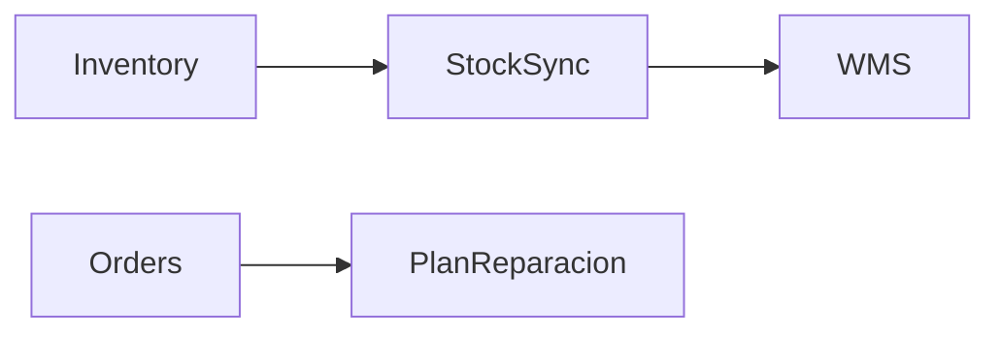
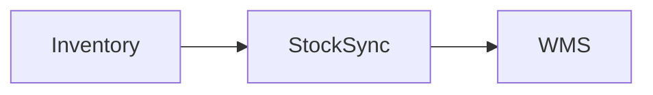

# Business Module Workflow

A repeatable, Claude Code–assisted methodology for building modules, libraries, or inter-module
features in a large-scale business software system.

This file carries the **shared core**: mode selection, the mode→reference map, shared artifacts
(INDEX.md, `.blueprint-status`, MAP.md), and navigation conventions. The full step-by-step
workflow for each mode lives in its own reference file.

---

## Mode Selection

Before starting any work, determine which mode applies and tell the user:

### MODULE MODE
Use when:
- Building a new application module from scratch with its own data model, routes, and UI
- The module has no pre-existing architectural patterns to inherit
- Scope spans multiple weeks / multiple developers
- Users interact with the module directly (screens, forms, dashboards)

→ Artifacts go in `blueprints/<ModuleName>(MODULE)/`

### LIBRARY MODE
Use when:
- Building a reusable SDK, library, or package (KMP, npm, Maven, pip, etc.)
- Primary output is a published artifact (`.jar`, `.tgz`, `.whl`) consumed by other code
- No REST endpoints or application screens — instead: a public API surface (types, interfaces, functions, utilities) that other code imports
- May include optional UI building blocks (React hooks, Angular components, KVision building blocks, etc.) that consumer apps assemble
- Consumers are developers, not end users

→ Artifacts go in `blueprints/<LibraryName>(LIBRARY)/`

### BRIDGE MODE
Use when:
- Adding a feature, entity, or workflow that sits *between* two or more existing modules
- The codebase architecture is already established (models, services, views patterns are known)
- Scope is typically 1–2 developers, days to 1–2 weeks
- The task is primarily: new entity + inter-module contracts + a few new/modified views

→ Artifacts go in `blueprints/<FeatureName>(BRIDGE)/`

### Decision guide — evaluate in this order:

1. **Is the primary output a published artifact consumed by other code** (`.jar`, `.tgz`, `.whl`, npm package)?
   → **LIBRARY MODE** — stop here, regardless of entity count.

2. **Does the scope span ≥3 new entities OR ≥3 new route groups**, with no pre-existing architecture to inherit?
   → **MODULE MODE**

3. **Otherwise** (existing architecture, 1–2 new entities, days-to-weeks scope)
   → **BRIDGE MODE**

When in doubt, ask the user: how many new entities, new views/screens, new routes, and which
existing modules are touched? Is the primary output a published artifact consumed by other code,
or an application users interact with?

---

## Mode → Reference Map (mandatory loading)

| Mode | Directory suffix | Workflow reference |
|------|-----------------|--------------------|
| MODULE | `(MODULE)` | `references/mode-module.md` |
| LIBRARY | `(LIBRARY)` — legacy: `(MODULE)`, see below | `references/mode-library.md` |
| BRIDGE | `(BRIDGE)` | `references/mode-bridge.md` |

> **Before working a blueprint, resolve its mode and read its reference file. Do not proceed
> on SKILL.md alone.** The reference files are normative — they carry the step sequence and
> the per-step Definitions of Done that cathedral audits cross-reference.

### Resolving the mode of an existing blueprint

1. **Unambiguous suffix** — `(LIBRARY)` or `(BRIDGE)` → that mode. Done.
2. **`(MODULE)` is ambiguous during the compatibility period**: legacy LIBRARY blueprints may
   still use it (libraries predating the `(LIBRARY)` suffix). Resolve in order:
   BRIEF.md `Mode` header row → INDEX.md declaration (see below) → else assume MODULE and
   state the assumption.
3. **A suffix outside this catalog** (e.g. `(FEATURE)`) → stop and tell the user; never borrow
   another skill's workflow for it.

**INDEX declarations** exist via exactly two mechanisms: the **Mode column** of the blueprint's
row (Active Modules & Libraries), or the **section→mode map** — *Active Bridges* ⇒ BRIDGE.
All other INDEX sections (Deferred, Deprecated, organizational groupings) declare nothing.

**BRIEF `Mode` row**: every new BRIEF carries its mode's fixed literal (`| Mode | MODULE |`,
`| Mode | LIBRARY |`, `| Mode | BRIDGE |`) — required by each mode's Step 0/B0 DoD. In
pre-existing BRIEFs its absence is never a violation — add it opportunistically on next touch.

---

## Overview of Artifacts

### Root (`blueprints/`)
| File | Purpose |
|------|---------|
| `INDEX.md` | Global status board — all modules, libraries, bridges |
| `MAP.md` | System roadmap — dependency graph, focus, blockers, north star |

### MODULE MODE
| Step | Artifact | Purpose |
|------|----------|---------|
| — | `.blueprint-status` | Single-line status file; source of truth for INDEX.md |
| 0 | `BRIEF.md` | Context, owner, justification |
| 1 | `SPECIFICATION.md` | What the module does |
| 2 | `FLOWCHART.md` | How it flows (Mermaid diagrams) |
| 3 | `API_CONTRACT.md` | How it connects to other modules |
| 4 | `VIEW_MAP.md` | Every screen, view, and UI change |
| 5 | `IMPLEMENTATION_PLAN.md` | How it will be built |
| 6 | `TEST_PLAN.md` | How it will be verified |
| 7 | `TRACEABILITY_MATRIX.md` | Living progress tracker (init after Step 5, update always) |
| — | `AUDIT.md` | Drift detection between blueprint and actual implementation |

### LIBRARY MODE
| Step | Artifact | Purpose |
|------|----------|---------|
| — | `.blueprint-status` | Single-line status file; source of truth for INDEX.md |
| 0 | `BRIEF.md` | Context, owner, library scope, platform/runtime targets, consumer modules |
| 1 | `SPECIFICATION.md` | What the library provides — functional requirements, entities, constraints |
| 2 | `FLOWCHART.md` | Data flows, processing pipelines, async patterns, lifecycle diagrams |
| 3 | `API_SURFACE.md` | Public API: types, interfaces, functions, utilities, published artifact coordinates |
| 4 | `VIEW_MAP.md` | *(Optional)* UI building blocks — only if library provides UI components |
| 5 | `IMPLEMENTATION_PLAN.md` | Build phases — build units, platform/runtime targets, publication steps |
| 6 | `TEST_PLAN.md` | Unit/integration tests per build unit, platform/runtime coverage, serialization |
| 7 | `TRACEABILITY_MATRIX.md` | Living progress tracker |
| — | `AUDIT.md` | Drift detection between API_SURFACE.md and actual implementation |

### BRIDGE MODE
| Step | Artifact | Purpose |
|------|----------|---------|
| — | `.blueprint-status` | Single-line status file; source of truth for INDEX.md |
| B0 | `BRIEF.md` | Scope, actors, affected modules, lifecycle type |
| B1 | `ENTITY_DESCRIPTOR.md` | New entity/entities: states, rules, data model |
| B2 | `SERVICE_CONTRACTS.md` | API / service boundaries between touched modules |
| B3 | `VIEW_MAP.md` | New views + existing views to modify |
| B4 | `IMPLEMENTATION_ORDER.md` | Flat execution order with checkboxes |
| — | `AUDIT.md` | Drift detection between blueprint and actual implementation |
| — | `ARCHIVED.md` | Created on deprecation |

> **TRACEABILITY_MATRIX.md is a living document.** Initialize it after Step 5 and update it
> continuously as work progresses. It is never "done."
>
> **AUDIT.md** is created after initial implementation and revisited at the start of each sprint
> or before onboarding a new developer.
>
> **blueprints/INDEX.md** is updated every time a blueprint is created, deprecated, or its status changes.
> Its status column is sourced from each blueprint's `.blueprint-status` file — never edited manually.
>
> **blueprints/MAP.md** is updated when development focus shifts, blockers change, or the dependency
> graph evolves. It is the roadmap view of the system; INDEX.md is the status board.
>
> **ARCHIVED.md** is created only for Temporary bridges, when their expiry condition is met.

---

## blueprints/INDEX.md — Global Blueprint Index

Create this file the first time any module, library, or bridge is started. Update it every time a
blueprint is created, changes status, or is deprecated. It is the single source of truth for the
state of the entire system design.

> **Status column is derived from `.blueprint-status` files** — see the section below.
> Never edit the Status column manually; instead update the corresponding `.blueprint-status` file
> and then refresh INDEX.md from it.

### Structure

```markdown
# Blueprints Index
**Updated**: [date]

## Active Modules & Libraries
| Name | Mode | Status | Phase | Owner | Notes |
|------|------|--------|-------|-------|-------|
| [ImportManagement(MODULE)](ImportManagement(MODULE)/BRIEF.md) | MODULE | 🟡 In Progress | Step 4 | @dev | Blocked on API contract review |
| [marketPlazeLib(LIBRARY)](marketPlazeLib(LIBRARY)/BRIEF.md) | LIBRARY | ✅ Complete | — | @team | |

## Active Bridges
| Bridge | Connects | Type | Status | Expiry Condition |
|--------|----------|------|--------|-----------------|
| [StockSync(BRIDGE)](StockSync(BRIDGE)/BRIEF.md) | Inventory ↔ WMS | Temporary | 🟡 Active | When WMS v2 ships |
| [PlanReparacion(BRIDGE)](PlanReparacion(BRIDGE)/BRIEF.md) | Orders ↔ Service | Permanent | 🟢 Stable | — |

## Deprecated
| Name | Reason | Deprecated On |
|------|--------|---------------|
| [OldImport(BRIDGE)](OldImport(BRIDGE)/ARCHIVED.md) | Absorbed by ImportManagement | 2024-Q1 |

## Dependency Map (optional)

```

The *Active Modules & Libraries* table's **Mode column** and the *Active Bridges* **section
membership** are this file's two mode declarations (see "Resolving the mode" above). Other
sections declare nothing about mode.

### Status Legend
| Icon | Status | Meaning |
|------|--------|---------|
| 🔵 | `PLANNING` | Blueprint in progress, no code yet |
| 🟡 | `ACTIVE` | Active development |
| 🎯 | `FOCUSED` | Current sprint's primary focus (1–2 max) |
| ⏸️ | `PAUSED` | Halted intentionally; reason in `.blueprint-status` |
| 🔴 | `BLOCKED` | Waiting on external dependency; reason in `.blueprint-status` |
| 🟢 | `STABLE` | In production, blueprint aligned |
| ⚠️ | `DRIFTED` | AUDIT.md flags misalignment |
| 🗄️ | `CLOSED` | Deprecated bridge — ARCHIVED.md exists |

---

## `.blueprint-status` — Per-Blueprint Status File

Every blueprint directory contains a single plain-text file called `.blueprint-status`.
It is the **authoritative source** for that blueprint's current status — INDEX.md reads from it,
never the other way around. Directory names are **never renamed** to encode status.

### Format

One line. Status keyword, optionally followed by `: <reason>`.

```
ACTIVE
```
```
PAUSED: waiting for UX sign-off on VIEW_MAP
```
```
BLOCKED: WMS v2 must deploy before this can continue
```

### Status Values

| Status | Icon | Meaning |
|--------|------|---------|
| `PLANNING` | 🔵 | Blueprint in progress, no code yet |
| `ACTIVE` | 🟡 | Under active development |
| `FOCUSED` | 🎯 | Current sprint's primary development focus (use sparingly — 1–2 at a time) |
| `PAUSED` | ⏸️ | Work halted intentionally; will resume. Always add `: <reason>` |
| `BLOCKED` | 🔴 | Waiting on an external dependency before work can continue. Always add `: <dependency>` |
| `STABLE` | 🟢 | In production; blueprint aligned with implementation |
| `DRIFTED` | ⚠️ | AUDIT.md flags misalignment between blueprint and implementation |
| `CLOSED` | 🗄️ | Temporary bridge that has been deprecated and archived |

> **`FOCUSED` is a sprint-level signal, not a permanent state.** At most 1–2 blueprints should
> carry `FOCUSED` at any time. When a sprint ends, update them back to `ACTIVE`.

**Why a file instead of a directory prefix?** Status changes are single-file edits (no git
renames, no shell-quoting pain), the reason field carries context a prefix can't, it's
grep-friendly (`find blueprints -name .blueprint-status | xargs grep BLOCKED`), and INDEX.md
derives from it — a single source of truth.

---

## blueprints/MAP.md — System Roadmap

`MAP.md` answers a different question than `INDEX.md`:

| File | Question |
|------|----------|
| `INDEX.md` | *What exists and what state is it in right now?* — **status board**: exhaustive, row-per-blueprint, always current |
| `MAP.md` | *Where is the system going? What depends on what? What's next?* — **roadmap**: curated, forward-looking, sequence and intent |

Create `MAP.md` when you have ≥3 blueprints and a multi-sprint horizon. Update it when focus
shifts, blockers change, or the dependency graph evolves. They reference each other; neither
duplicates the other's data.

### Structure

```markdown
# System Roadmap
**Updated**: [date]
**Current Focus**: [1–2 blueprint names that are FOCUSED right now]

## Dependency Graph



> Arrows mean "must complete or be stable before the downstream work begins."

## Sprint / Cycle Focus

| Blueprint | Status | Goal This Sprint |
|-----------|--------|-----------------|
| [OrderManagement(MODULE)](OrderManagement(MODULE)/BRIEF.md) | 🎯 FOCUSED | Complete API contract review |

## Upcoming (Next 2–3 Sprints)

| Blueprint | Mode | Unblocked By | Notes |
|-----------|------|-------------|-------|
| Billing(MODULE) | MODULE | OrderManagement stable | Q3 target |

## Blocked / Waiting

| Blueprint | Blocked On | Owner | Est. Resolution |
|-----------|-----------|-------|----------------|
| WMS(MODULE) | Vendor API contract | @vendor-team | 2024-Q3 |

## North Star

[1–2 sentences: where is the overall system heading in the next 2–4 quarters?]
```

---

## Artifact Navigation

Every `.md` artifact must include a navigation footer so readers can jump between documents without leaving their editor or browser.

### Rules

1. **Always at the bottom** — the nav block is the very last content in the file, after all sections.
2. **Current artifact is bold and not a link** — so the reader knows where they are.
3. **Only link artifacts that already exist** — if an artifact hasn't been generated yet, render it as plain text (no brackets, no link). This includes `../MAP.md`.
4. **Always include the INDEX link; include the MAP link once it exists** — `INDEX.md` exists from the first blueprint, so `Index` is always a link. `MAP.md` is created only at ≥3 blueprints; until then render `Map` as plain text.
5. **Regenerate when a new artifact is created** — when generating artifact N, update the footer of all previously generated artifacts in the same blueprint directory to add the new link.

### MODULE MODE footer template

```markdown
---
[← Index](../INDEX.md) · [Map](../MAP.md) · **BRIEF** · [SPEC](SPECIFICATION.md) · [FLOWCHART](FLOWCHART.md) · [API](API_CONTRACT.md) · [VIEWS](VIEW_MAP.md) · [PLAN](IMPLEMENTATION_PLAN.md) · [TESTS](TEST_PLAN.md) · [MATRIX](TRACEABILITY_MATRIX.md) · [AUDIT](AUDIT.md)
```

Replace **BRIEF** with the name of the current file in bold. Files not yet created appear as plain text without brackets:

```markdown
---
[← Index](../INDEX.md) · Map · [BRIEF](BRIEF.md) · **SPEC** · FLOWCHART · API · VIEWS · PLAN · TESTS · MATRIX · AUDIT
```

### LIBRARY MODE footer template

```markdown
---
[← Index](../INDEX.md) · [Map](../MAP.md) · **BRIEF** · [SPEC](SPECIFICATION.md) · [FLOWCHART](FLOWCHART.md) · [API SURFACE](API_SURFACE.md) · [VIEWS](VIEW_MAP.md) · [PLAN](IMPLEMENTATION_PLAN.md) · [TESTS](TEST_PLAN.md) · [MATRIX](TRACEABILITY_MATRIX.md) · [AUDIT](AUDIT.md)
```

`VIEW_MAP.md` is optional in LIBRARY MODE — if the library provides no UI components, omit it from the footer.

### BRIDGE MODE footer template

```markdown
---
[← Index](../INDEX.md) · [Map](../MAP.md) · **BRIEF** · [ENTITY](ENTITY_DESCRIPTOR.md) · [CONTRACTS](SERVICE_CONTRACTS.md) · [VIEWS](VIEW_MAP.md) · [ORDER](IMPLEMENTATION_ORDER.md) · [AUDIT](AUDIT.md)
```

---

## Prompt Patterns

Reusable Claude Code prompt patterns for INDEX/status/MAP updates, artifact generation, and
navigation footers live in `references/example-prompts.md`.
