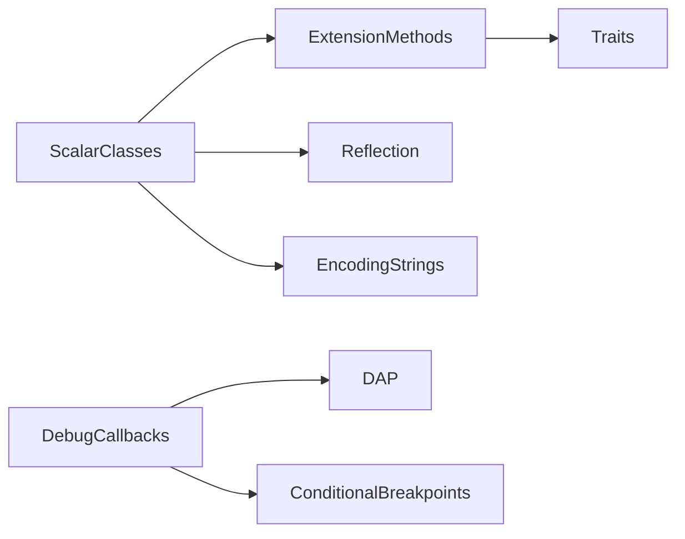
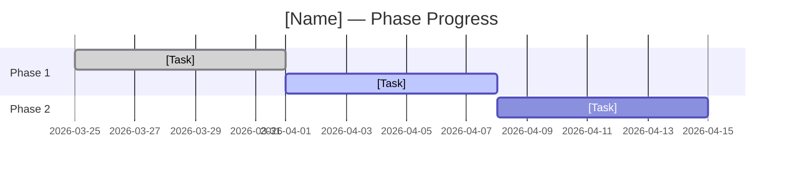

# Systems Blueprint Workflow

A repeatable, Claude Code-assisted methodology for planning, tracking, and auditing
structural changes to systems-level software: compilers, virtual machines, runtimes,
database engines, language toolchains, and similar low-level codebases.

This workflow exists because systems code has properties that business-app workflows
don't account for:

- **No UI, no REST APIs, no user roles.** The "interface" is a C function signature,
  an opcode, a struct layout, or a grammar rule.
- **ABI matters.** Changing `sizeof(struct)` breaks every pre-compiled extension.
- **Performance is a requirement, not a nice-to-have.** A 5% regression in the VM
  hot loop is a showstopper.
- **Backward compatibility is measurable.** You can count call sites, grep for
  affected patterns, and quantify the blast radius of every change.
- **The "spec" is often the existing code.** There may be no document describing
  what the GC does — the GC *is* the document.

---

## blueprints/INDEX.md — Global Status Board

Create on first blueprint. Update every time a blueprint is created or changes status.
Single source of truth for the state of all workstreams.

### Structure

```markdown
# Blueprints Index
**Updated**: [date]
**North Star**: [1-2 sentences]

## Active Workstreams
| Name | Mode | Status | Phase | Owner | Blocked By |
|------|------|--------|-------|-------|------------|
| [ScalarClasses(SUBSYSTEM)](ScalarClasses(SUBSYSTEM)/BRIEF.md) | SUBSYSTEM | 🎯 FOCUSED | Design | @dev | — |
| [DAP(FEATURE)](DAP(FEATURE)/BRIEF.md) | FEATURE | 🔵 PLANNING | — | @dev | DebugCallbacks |

## Completed
| Name | Completed | Notes |
|------|-----------|-------|
| [DeadCodeCleanup(PATCH)](DeadCodeCleanup(PATCH)/BRIEF.md) | 2026-03 | Removed 45 #if 0 blocks |

## Dependency Graph

```

### Status Legend

| Icon | Status | Meaning |
|------|--------|---------|
| 🔵 | `PLANNING` | Design artifacts in progress, no code yet |
| 🟡 | `ACTIVE` | Implementation underway |
| 🎯 | `FOCUSED` | Current sprint primary focus (1-2 max) |
| ⏸️ | `PAUSED` | Halted intentionally; reason in `.blueprint-status` |
| 🔴 | `BLOCKED` | Waiting on another workstream or external dependency |
| 🟢 | `STABLE` | Merged, tested, verified — done |
| ⚠️ | `DRIFTED` | AUDIT.md flags misalignment between design and code |

---

## `.blueprint-status` — Per-Blueprint Status File

Every blueprint directory contains `.blueprint-status`. One line. Status keyword,
optionally followed by `: <reason>`.

```
FOCUSED
```
```
BLOCKED: requires ScalarClasses to land first
```
```
STABLE
```

INDEX.md reads from `.blueprint-status` — never edited manually in INDEX.md.

---

## blueprints/MAP.md — System Roadmap

Create when you have 3+ blueprints. Shows dependency order, sprint focus, and blockers.

```markdown
# System Roadmap
**Updated**: [date]
**Current Focus**: [1-2 FOCUSED blueprints]

## Dependency Graph


## Sprint Focus
| Blueprint | Status | Goal This Sprint |
|-----------|--------|-----------------|
| ScalarClasses(SUBSYSTEM) | 🎯 | Wire existing tscalar.prg classes into VM dispatch |

## Upcoming
| Blueprint | Mode | Unblocked By | Notes |
|-----------|------|-------------|-------|
| ExtensionMethods(FEATURE) | FEATURE | ScalarClasses | EXTEND CLASS syntax |

## Blocked
| Blueprint | Blocked On | Est. Resolution |
|-----------|-----------|----------------|
| Traits(FEATURE) | ExtensionMethods | Sprint 5 |

## North Star
[1-2 sentences — where is the project heading]
```

---

## Mode Selection

Before starting any work, determine which mode applies:

### SUBSYSTEM MODE

Use when:
- Changing the internal architecture of a core component (VM, compiler, GC, type system)
- Multiple files across multiple directories are affected
- The change has ABI, performance, or compatibility implications
- Existing behavior must be preserved while internals change
- Scope spans multiple weeks

Examples: scalar class wiring, VM dispatch refactor, gradual typing, encoding-aware strings.

Directory: `blueprints/<Name>(SUBSYSTEM)/`

### FEATURE MODE

Use when:
- Adding a self-contained capability that plugs into existing architecture
- The existing architecture is not restructured — only extended
- Clear input/output boundary (new protocol, new syntax, new driver)
- Scope is 1-3 weeks

Examples: DAP debug server, conditional breakpoints, extension methods, traits/mixins.

Directory: `blueprints/<Name>(FEATURE)/`

### PATCH MODE

Use when:
- Targeted fix or improvement with minimal blast radius
- Single concern: bug fix, performance optimization, dead code removal, warning fix
- Scope is days, not weeks
- Low risk of unintended side effects

Examples: dead code cleanup, HB_SIZE type resolution, key poll configurability.

Directory: `blueprints/<Name>(PATCH)/`

### Decision Guide

1. **Does it change the internal structure of a core component?** → SUBSYSTEM
2. **Does it add new capability without restructuring?** → FEATURE
3. **Is it a single-concern fix or cleanup?** → PATCH

---

## Artifact Overview

### Root (`blueprints/`)
| File | Purpose |
|------|---------|
| `INDEX.md` | Global status board |
| `MAP.md` | Dependency graph, sprint focus, roadmap |

### SUBSYSTEM MODE — Deep Structural Changes
| Step | Artifact | Purpose |
|------|----------|---------|
| — | `.blueprint-status` | Single-line status; source of truth for INDEX.md |
| 0 | `BRIEF.md` | Scope, motivation, affected components, compatibility stance |
| 1 | `DESIGN.md` | What changes: structs, memory layout, dispatch, registration |
| 2 | `ARCHITECTURE.md` | How it flows: call graphs, data flow, execution paths (Mermaid) |
| 3 | `C_API.md` | New/changed function signatures, header changes, ABI impact |
| 4 | `COMPAT.md` | Fracture analysis: what breaks, blast radius, mitigations |
| 5 | `IMPLEMENTATION_PLAN.md` | Phased build order with dependencies |
| 6 | `TEST_PLAN.md` | Test cases: regression, performance, compatibility |
| 7 | `TRACEABILITY.md` | Living tracker: requirement → code → test |
| — | `AUDIT.md` | Drift detection between design and actual implementation |

### FEATURE MODE — Self-Contained Additions
| Step | Artifact | Purpose |
|------|----------|---------|
| — | `.blueprint-status` | Single-line status |
| F0 | `BRIEF.md` | Scope, motivation, integration points |
| F1 | `DESIGN.md` | What the feature does, internal design decisions |
| F2 | `C_API.md` | Public interface: function signatures, new opcodes, new syntax |
| F3 | `IMPLEMENTATION_PLAN.md` | Build order with checkboxes |
| F4 | `TEST_PLAN.md` | Test cases |
| — | `AUDIT.md` | Drift detection |

### PATCH MODE — Targeted Fixes
| Step | Artifact | Purpose |
|------|----------|---------|
| — | `.blueprint-status` | Single-line status |
| P0 | `BRIEF.md` | What, why, blast radius, rollback plan |
| P1 | `CHANGESET.md` | Exact files and functions affected, before/after |
| P2 | `TEST_PLAN.md` | Regression tests proving the fix and no side effects |
| — | `AUDIT.md` | Optional — only if patch scope grew unexpectedly |

---

## Artifact Navigation

Every `.md` artifact includes a navigation footer. Current artifact is bold.
Only link artifacts that exist. Update all footers when creating a new artifact.

### SUBSYSTEM footer
```markdown
---
[← Index](../INDEX.md) · [Map](../MAP.md) · **BRIEF** · [DESIGN](DESIGN.md) · [ARCH](ARCHITECTURE.md) · [API](C_API.md) · [COMPAT](COMPAT.md) · [PLAN](IMPLEMENTATION_PLAN.md) · [TESTS](TEST_PLAN.md) · [MATRIX](TRACEABILITY.md) · [AUDIT](AUDIT.md)
```

### FEATURE footer
```markdown
---
[← Index](../INDEX.md) · [Map](../MAP.md) · **BRIEF** · [DESIGN](DESIGN.md) · [API](C_API.md) · [PLAN](IMPLEMENTATION_PLAN.md) · [TESTS](TEST_PLAN.md) · [AUDIT](AUDIT.md)
```

### PATCH footer
```markdown
---
[← Index](../INDEX.md) · [Map](../MAP.md) · **BRIEF** · [CHANGESET](CHANGESET.md) · [TESTS](TEST_PLAN.md) · [AUDIT](AUDIT.md)
```

---

# SUBSYSTEM MODE — Full Workflow

---

## Step 0: BRIEF.md

### Purpose
Establish scope, motivation, and compatibility stance before any design work.

### Required Fields

| Field | Description |
|-------|-------------|
| Name | PascalCase identifier, e.g. `ScalarClasses` |
| Component | Which part of the system this changes (VM, Compiler, RTL, RDD, etc.) |
| Motivation | Why this change is needed — the pain it solves |
| Affected Files | Key source files that will be modified (top 5-10) |
| Affected Structs | Data structures that change (e.g. `HB_ITEM`, `CLASS`, `METHOD`) |
| Compatibility Stance | Target compatibility % and the non-negotiable rules |
| Performance Stance | Must be faster / must not regress / performance irrelevant |
| Dependencies | Other workstreams that must complete first |
| Estimated Scope | Weeks of effort |

### Claude Code Prompt Pattern
```
I need to plan a subsystem change called [Name] in [project].
Component: [VM/Compiler/RTL/etc.]
Motivation: [why]
Key files affected: [list]
Compatibility target: [e.g. 99.5%]
Help me write BRIEF.md. Identify risks and flag anything underspecified.
```

### Definition of Done
- [ ] All fields populated
- [ ] Affected files verified to exist
- [ ] Compatibility stance is specific (not "best effort")
- [ ] Dependencies identified and checked against INDEX.md

---

## Step 1: DESIGN.md

### Purpose
Define *what* changes at the C/implementation level — structs, memory layout,
registration, dispatch, new types. This is the technical specification.

### Required Sections

1. **Current State** — how the component works today, with code references
2. **Problem Statement** — what specifically is wrong or missing (not motivation — mechanics)
3. **Proposed Changes** — struct modifications, new functions, changed behavior
4. **Memory Layout Impact** — does `sizeof()` change? alignment? padding?
5. **Registration / Initialization** — what runs at startup, what order
6. **Dispatch / Resolution** — how the new code integrates into existing call paths
7. **Performance Analysis** — hot path impact, expected overhead, benchmarks needed
8. **Alternatives Considered** — what else was evaluated and why it was rejected

### Format for Struct Changes
```markdown
### `HB_ITEM` — Modified
**File**: `include/hbapi.h:393-415`
**Current size**: X bytes (verify with `sizeof`)
**Proposed change**: Add `encoding` field to `hb_struString`
```c
struct hb_struString {
   HB_SIZE  length;
   HB_SIZE  allocated;
   char *   value;
   HB_BYTE  encoding;     // NEW — 0=legacy, 1=UTF8, 2=binary
};
```
**Size impact**: [fits in padding / adds N bytes / needs verification]
**ABI impact**: [source-compat only / full ABI break / none]
```

### Format for New Functions
```markdown
### `hb_objGetScalarClass()` — New
**File**: `src/vm/classes.c`
**Signature**: `HB_USHORT hb_objGetScalarClass( HB_TYPE type )`
**Purpose**: Returns the class handle for a scalar type
**Called from**: `hb_objGetMethod()` when `uiClass == 0`
**Performance**: O(1) lookup table, no allocation
```

### Claude Code Prompt Pattern
```
Based on BRIEF.md for [Name], generate DESIGN.md.
Read the current implementation in [list key files].
Document the current state with line references, then describe
every proposed change with struct diffs, new function signatures,
and memory layout analysis. Flag any sizeof() impact.
```

### Definition of Done
- [ ] Current state documented with file:line references
- [ ] Every struct change shows before/after with size impact
- [ ] Every new function has signature, purpose, and caller
- [ ] Memory layout impact analyzed
- [ ] Performance impact on hot paths assessed
- [ ] At least one alternative considered

---

## Step 2: ARCHITECTURE.md

### Purpose
Visualize execution flow, call graphs, and data paths using Mermaid diagrams.
Systems code is hard to reason about from text alone — diagrams make the
implicit call chains explicit.

### Required Diagrams

1. **Current Call Graph** — how the relevant code paths work today
2. **Proposed Call Graph** — how they will work after the change
3. **Data Flow** — how data moves through the affected components
4. **Initialization Sequence** — what registers/initializes in what order
5. **Hot Path Analysis** — the performance-critical execution path, annotated

### Mermaid Conventions
- Use `flowchart TD` for call graphs
- Use `sequenceDiagram` for initialization and multi-component flows
- Use `graph LR` for data flow
- Mark hot paths with `:::critical` or bold arrows
- Label every edge with the function name or condition

### Claude Code Prompt Pattern
```
Based on DESIGN.md for [Name], generate ARCHITECTURE.md.
I need Mermaid diagrams showing:
1. Current call graph for [specific function/path]
2. Proposed call graph after changes
3. Data flow through [component]
4. Initialization sequence
5. Hot path with performance annotations
Read the actual code to verify call chains — don't guess.
```

### Definition of Done
- [ ] Current and proposed call graphs both present
- [ ] Call graphs verified against actual code (not hypothetical)
- [ ] Hot path identified and annotated
- [ ] Initialization order documented
- [ ] All diagrams render without Mermaid errors

---

## Step 3: C_API.md

### Purpose
Define every public interface change — new functions, changed signatures,
new opcodes, new macros, new header entries. This is the contract that
other code (extensions, contribs, user C code) depends on.

### Required Sections

1. **New Functions** — signature, header file, purpose, thread safety
2. **Changed Functions** — old signature → new signature, migration path
3. **Removed Functions** — what was removed, replacement, deprecation period
4. **New Opcodes** — pcode additions with encoding and operands
5. **New Macros / Types** — `#define` and `typedef` additions
6. **Header Changes** — which `.h` files are modified
7. **ABI Compatibility** — does this require recompilation of C extensions?

### Format for Each Entry
```markdown
### `hb_objGetScalarClass()` — NEW
- **Header**: `include/hbapicls.h`
- **Signature**: `extern HB_EXPORT HB_USHORT hb_objGetScalarClass( HB_TYPE type );`
- **Thread Safety**: Safe — read-only after VM init
- **Availability**: Always (not gated behind compile flag)
```

### Definition of Done
- [ ] Every new/changed/removed public symbol documented
- [ ] ABI impact clearly stated
- [ ] Migration path provided for changed/removed functions
- [ ] Header file locations specified

---

## Step 4: COMPAT.md

### Purpose
Quantify the compatibility impact. Not "will it break?" but "what exactly breaks,
how many call sites, how discoverable, and how to mitigate."

This artifact is unique to systems work. Business apps rarely need it. Systems code
*always* does.

### Required Sections

1. **Compatibility Target** — the specific percentage and what it means
2. **Fracture Map** — one entry per potential break, with:
   - Description
   - Affected call sites (grep count)
   - Risk percentage
   - Silent or loud? (crash vs. wrong result vs. compile error)
   - Discoverability (compile-time, link-time, test-time, runtime, never)
   - Mitigation
3. **Compatibility Covenant** — the non-negotiable rules this change obeys
4. **Migration Guide** — for users/extensions that are affected, step-by-step

### Fracture Entry Format
```markdown
### Fracture N: [Name] — Risk: X.XX%
**Description**: [what breaks]
**Call sites**: [N] across [M] files (`grep -r "pattern" src/ contrib/ | wc -l`)
**Silent?**: [Yes — wrong result / No — compile error / No — crash]
**Discoverable**: [compile-time / link-time / first test run / runtime / never]
**Mitigation**: [what to do about it]
```

### Definition of Done
- [ ] Every known fracture documented with grep-verified call site counts
- [ ] Risk percentages assigned
- [ ] Compatibility covenant has specific, testable rules
- [ ] Migration guide provided for the non-zero fractures
- [ ] Total risk sums to the number claimed in BRIEF.md

---

## Step 5: IMPLEMENTATION_PLAN.md

### Purpose
Break the work into phases ordered by dependency. Each phase produces
a compilable, testable state — no phase leaves the build broken.

### Required Sections

1. **Phase Breakdown** — 3-5 phases, each with a shippable milestone
2. **File Change Matrix** — which files are touched in which phase
3. **Build Verification** — how to confirm each phase doesn't break the build
4. **Performance Checkpoints** — where to benchmark after each phase
5. **Rollback Points** — how to revert each phase independently
6. **Risk Register** — top risks with mitigation

### Phase Template
```markdown
## Phase N: [Name]
- **Milestone**: [what is true when this phase is done]
- **Files touched**: [list]
- **Build verification**: `make && bin/linux/gcc/hbtest`
- **Performance checkpoint**: [benchmark command or "N/A"]
- **Rollback**: `git revert` to commit before phase / feature flag off
- **Depends on**: [Phase N-1 / external]
- **Estimated effort**: [days]
```

### Definition of Done
- [ ] Each phase leaves the build green
- [ ] Every file from DESIGN.md is assigned to a phase
- [ ] Performance checkpoints defined for hot-path phases
- [ ] Rollback strategy for each phase
- [ ] Risk register has 3+ entries

---

## Step 6: TEST_PLAN.md

### Purpose
Define tests that prove correctness, compatibility, and performance.
Systems tests are not user journeys — they are assertions about behavior
at the function, opcode, and integration level.

### Required Sections

1. **Regression Tests** — existing behavior that must not change
2. **New Behavior Tests** — new functionality that must work
3. **Compatibility Tests** — prove the fractures from COMPAT.md are mitigated
4. **Performance Tests** — benchmarks with acceptable thresholds
5. **Stress Tests** — edge cases, large inputs, concurrent access

### Test Entry Format
```markdown
### TEST-NNN: [Name]
- **Type**: Regression / New / Compat / Perf / Stress
- **Covers**: [DESIGN.md section or COMPAT.md fracture]
- **Setup**: [preconditions]
- **Action**: [what to execute — .prg code, C function call, or hbtest assertion]
- **Expected**: [specific result]
- **Threshold**: [for perf tests: max time, max memory, max regression %]
```

### Definition of Done
- [ ] Every struct change has a regression test
- [ ] Every new function has a behavior test
- [ ] Every COMPAT.md fracture has a compatibility test
- [ ] Performance-critical changes have benchmarks with thresholds
- [ ] Tests are executable (hbtest assertions or compilable .prg files)

---

## Step 7: TRACEABILITY.md (Living Document)

### Purpose
Track progress and link design → code → test. Initialize after Step 5.
Update after every commit, merge, or sprint.

### Structure
```markdown
# Traceability — [Name]
**Last Updated**: [date]
**Overall**: [X/N items complete]

## Progress


## Design → Code → Test
| Design Item | Phase | File:Function | Status | Test ID |
|-------------|-------|---------------|--------|---------|
| Scalar class registration | 1 | classes.c:hb_clsInit | Done | TEST-001 |
| hb_objGetScalarClass() | 1 | classes.c:hb_objGetScalarClass | In Progress | TEST-002 |

## Open Issues
| Issue | Impact | Target |
|-------|--------|--------|
```

### Definition of Done
*Never "done" — complete when all design items show verified and all phases
show done in the Gantt.*

---

## AUDIT.md — Design vs. Implementation Drift Detection

Create after initial implementation begins. Revisit at the start of each sprint.

### Structure
```markdown
# Audit — [Name]
**Last Audit**: [date]
**Overall**: ✅ Aligned | ⚠️ Partial Drift | 🔴 Stale

## Drift Log
| Artifact | Section | Design Says | Reality | Severity | Action |
|----------|---------|-------------|---------|----------|--------|

## Checklist
- [ ] DESIGN.md struct changes match actual code
- [ ] C_API.md signatures match actual headers
- [ ] COMPAT.md fractures verified — no new ones discovered
- [ ] Performance thresholds from TEST_PLAN.md met
- [ ] TRACEABILITY.md reflects actual completion

## Notes
[Decisions made during implementation that diverge from the blueprint]
```

### Severity Guide
| Level | Meaning |
|-------|---------|
| Low | Minor naming or comment difference |
| Medium | Changed approach but same outcome |
| High | Interface mismatch affecting other workstreams |
| Critical | Design actively misleads — must update before continuing |

### Claude Code Prompt Pattern
```
Perform a blueprint audit for [Name].
Read all artifacts in blueprints/[Name](SUBSYSTEM)/.
Then inspect the actual code in [list directories].
Compare design claims against reality. Populate the Drift Log.
Flag every discrepancy with severity. Set Overall Status.
```

---

# FEATURE MODE — Self-Contained Additions

Lighter than SUBSYSTEM. No ARCHITECTURE.md (the architecture isn't changing).
No COMPAT.md (features add, they don't break — but if they do, escalate to SUBSYSTEM).

Follow steps F0-F4 using the same artifact formats as SUBSYSTEM mode but with
these differences:

- **BRIEF.md** — simpler: no "Affected Structs" or "Compatibility Stance" unless the
  feature introduces new keywords or changes dispatch.
- **DESIGN.md** — focus on the new feature's internal design, not the system's current state.
  Include a "Integration Points" section showing where the feature hooks in.
- **C_API.md** — only new symbols. No "Changed" or "Removed" sections unless the
  feature deprecates something.
- **IMPLEMENTATION_PLAN.md** — can be a flat checklist instead of phases if scope is small.
- **TEST_PLAN.md** — focus on new behavior tests. Regression tests only for the
  integration points.

### When to Escalate to SUBSYSTEM

If during DESIGN you discover that the feature requires:
- Changing existing struct layouts
- Modifying the VM hot loop
- Affecting >10 files across >3 directories
- Breaking any existing behavior

...stop and re-scope as SUBSYSTEM. Add ARCHITECTURE.md and COMPAT.md.

---

# PATCH MODE — Targeted Fixes

Minimal overhead. Three artifacts max.

### P0: BRIEF.md

| Field | Description |
|-------|-------------|
| Name | What is being fixed |
| Problem | Specific bug, debt, or performance issue |
| Root Cause | Why it happens (with file:line references) |
| Fix | What the fix is (one paragraph) |
| Blast Radius | Files touched, call sites affected |
| Rollback | How to revert if the fix causes problems |

### P1: CHANGESET.md

Exact before/after for every change. Not a diff — a readable document showing
what was, what will be, and why.

```markdown
### File: `src/vm/fm.c` lines 776-783
**Before**: Validation checks disabled with `#if 0`
**After**: Checks re-enabled with proper error handling
**Why**: Disabled checks hide NULL pointer bugs in realloc paths
```

### P2: TEST_PLAN.md

Regression test proving the fix works and nothing else broke.
Same format as SUBSYSTEM TEST_PLAN.md but typically 3-5 tests, not 30.

---

# Workflow Summary

```
blueprints/INDEX.md        → create on first blueprint; refresh from .blueprint-status
blueprints/MAP.md          → create at 3+ blueprints; update when focus/blockers change

SUBSYSTEM MODE (deep structural change):
  Step 0: BRIEF.md          → scope, motivation, compatibility stance
  Step 1: DESIGN.md         → structs, functions, memory layout, dispatch
  Step 2: ARCHITECTURE.md   → call graphs, data flow, hot paths (Mermaid)
  Step 3: C_API.md          → public interface changes, ABI impact
  Step 4: COMPAT.md         → fracture analysis, blast radius, mitigations
  Step 5: IMPLEMENTATION_PLAN.md → phased build order
           └─ Initialize TRACEABILITY.md; update .blueprint-status → ACTIVE
  Step 6: TEST_PLAN.md      → regression, new, compat, perf tests
  Step 7: TRACEABILITY.md   → update continuously
  AUDIT.md                  → drift detection each sprint

FEATURE MODE (self-contained addition):
  F0: BRIEF.md              → scope, integration points
  F1: DESIGN.md             → feature design, hook points
  F2: C_API.md              → new public symbols
  F3: IMPLEMENTATION_PLAN.md → build order (flat checklist OK)
  F4: TEST_PLAN.md          → new behavior + integration regression
  AUDIT.md                  → drift detection

PATCH MODE (targeted fix):
  P0: BRIEF.md              → problem, root cause, fix, blast radius
  P1: CHANGESET.md          → before/after for every change
  P2: TEST_PLAN.md          → regression proof
  AUDIT.md                  → optional
```
